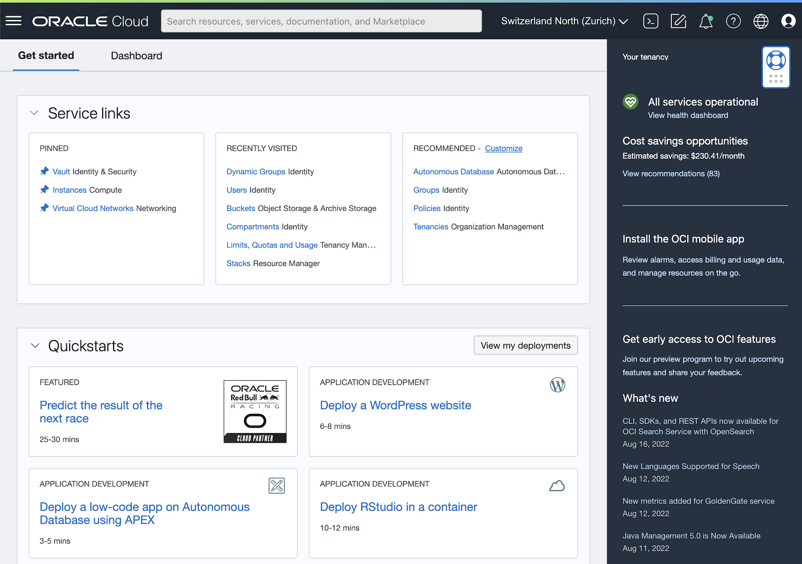

<!-- markdownlint-disable MD013 -->
<!-- markdownlint-disable MD025 -->
# Anforderungen Oracle Cloud (OCI) Kickstart Workshop

Wolltest Du schon immer einmal die Möglichkeiten der
*Oracle Cloud Infrastruktur (OCI)* genauer anschauen, hattest aber nie Zeit gefunden?
Dann ist unser *Oracle Cloud (OCI) Kickstart Workshop* genau das Richtige. Nach
einer theoretischen Einführung geht es ab in die Cloud. Als Teilnehmer von diesem
Workshop hast Du die Gelegenheit verschiedene Themen am praktischen Beispiel zu
vertiefen. Dazu erhältst Du Zugang zu einer *Oracle Cloud Umgebung*, welche
Du im Rahmen des Workshops nutzen kannst. Zudem sind die Beispiele und Übungen
in einem *GitHub* Repository abgelegt und stehen Dir auch nach dem Workshop zu
Verfügung. Das Repository wird während der *DOAG Konferenz* frei geschaltet und ist
via [DOAG 2022 O-OCI-WS](https://url.oradba.ch/DOAG22) verfügbar. Falls Du Fragen
hast, zögere nicht, am DOAG / SOUG Stand vorbei zu kommen und nach Stefan Oehrli
oder Martin Berger zu Verlangen.

## Voraussetzungen und Skills

Die Übungen im Workshop erlauben den schrittweise Einstig in das Thema
*Oracle Cloud Infrastructure (OCI)*. Dazu werden folgende Kenntnisse der
Teilnehmer empfohlen:

- Praktische Erfahrung im Umgang mit Shell Skripten, SSH und der Kommando Zeile.
- Oracle Datenbank Grundlagen wie Installation, Konfiguration und Administration.
- Basis Kenntnisse im Umgang mit GIT respektive *[GitHub](https://github.com/)*.

## Oracle Cloud Infrastructure (OCI) Umgebung

Die praktischen Arbeiten werden in der *Oracle Cloud Infrastructure (OCI)* Console
durchgeführt. Dazu reicht ein Notebook mit Internet Zugang sowie einem aktuellen
Browser.

Zwingende Voraussetzungen:

- Zugang zur *Oracle Cloud Infrastructure (OCI)*. Ein entsprechender Tenant
  respektive Zugang zu einem Tenant wird im Rahmen des Workshops bereitgestellt
- Notebook mit Internet Zugang via DOAG WLAN.
- Aktueller Browser für *Oracle Cloud Infrastructure (OCI)*. Siehe auch
  [Supported Browsers](https://docs.oracle.com/en-us/iaas/Content/GSG/Tasks/signinginIdentityDomain.htm#Supporte)
- Persönliche Tools, um Notizen zu erstellen und Shell Skripte anzupassen.

::: note
**Hinweis** Bitte prüfe den Zugriff auf [cloud.oracle.com](cloud.oracle.com) via
*WLAN* bereits während der DOAG Konferenz. Am Schulungstag fokussieren wir uns
primär auf die Workshop Themen und können nur bedingt Zeit für das Troubleshooting
des Netzwerkzuganges aufwenden.
:::

Daneben werden folgende Voraussetzungen empfohlen, diese sind aber nicht zwingend
erforderlich für die praktischen Arbeiten am Workshop:

- GitHub Account für den Zugriff und Download des Source Codes. Der einfache
  Download geht grundsätzlich ohne Account.
- SSH Terminal wie Putty, MobaXterm oder OpenSSH.
- SQL Tool wie SQL Developer, Toad oder ähnlichem für den Zugriff auf Datenbanken.
- Text Editor oder Entwicklungstool z.B. *Microsoft Visual Studio Code*
- Eigene *Oracle Cloud Infrastructure (OCI)* Umgebung, um im Anschluss an den
  Workshop das erarbeitete Wissen weiter zu nutzen.
- Umgebung um *Terraform* und das *OCI Command line Interface* remote auszuführen.

## Dokumentation und Referenzen

Folgend Information sind im Rahmen des *Oracle Cloud (OCI) Kickstart Workshop*
hilfreich:

- Oracle Cloud Infrastructure Documentation [Übersicht](https://docs.oracle.com/en-us/iaas/Content/home.htm)
- Oracle Cloud Infrastructure Documentation [Getting Started](https://docs.oracle.com/en-us/iaas/Content/GSG/Concepts/baremetalintro.htm)
- Oracle Cloud Infrastructure Documentation [Command Line Interface (CLI)]([Command Line Interface (CLI)](https://docs.oracle.com/en-us/iaas/Content/API/Concepts/cliconcepts.htm))
- Terraform [Documentation](https://www.terraform.io/docs)
- Terraform Dokumentation [Oracle Cloud Infrastructure Provider](https://registry.terraform.io/providers/oracle/oci/latest/docs)
- Microsoft [Visual Studio Code](https://code.visualstudio.com/)
- [Excalidraw](https://excalidraw.com/) a virtual collaborative whiteboard tool
