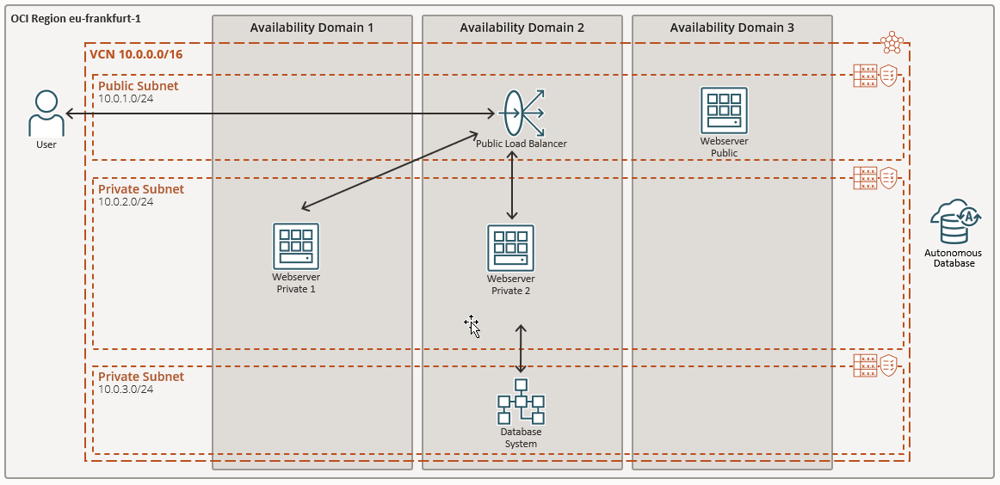

<!-- markdownlint-disable MD013 -->
<!-- markdownlint-disable MD025 -->
<!-- markdownlint-configure-file { "MD024":{"allow_different_nesting": true }} -->

# OCI Walkthrough
<!-- markdownlint-disable MD041 -->
<!-- markdownlint-disable MD051 -->
## Architektur

Gemeinsam bauen wir folgende Infrastruktur in der *Region Germany Central (Frankfurt)*:

- Virtual Cloud Network VCN
- Compute Instances mit Public Load Balancer
- Database Service
- Eine Verbindung von der Compute Instance zur Oracle Datenbank
- Eine Autonomous Database ATP
- Upload zum OCI Object Storage

Im zweiten Teil des Workshops bauen wir verschieden Umgebungen mit der Hilfe von
Terraform neu auf und sehen so, wie man Cloud basierte Infrastrukturen dank
*Infrastructure as Code (IaC)* bewirtschaftet.
