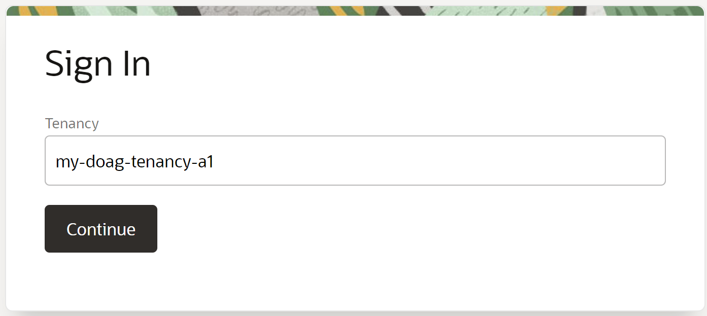
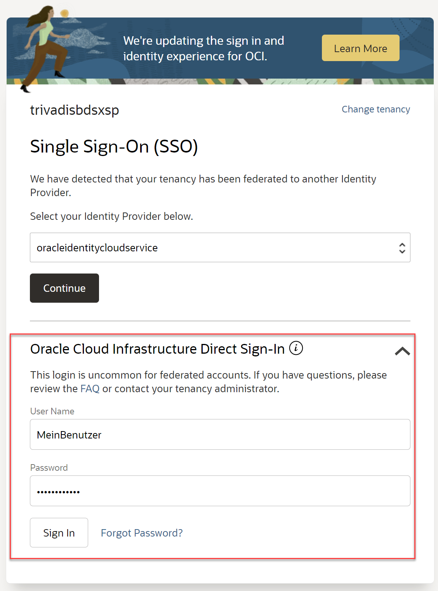
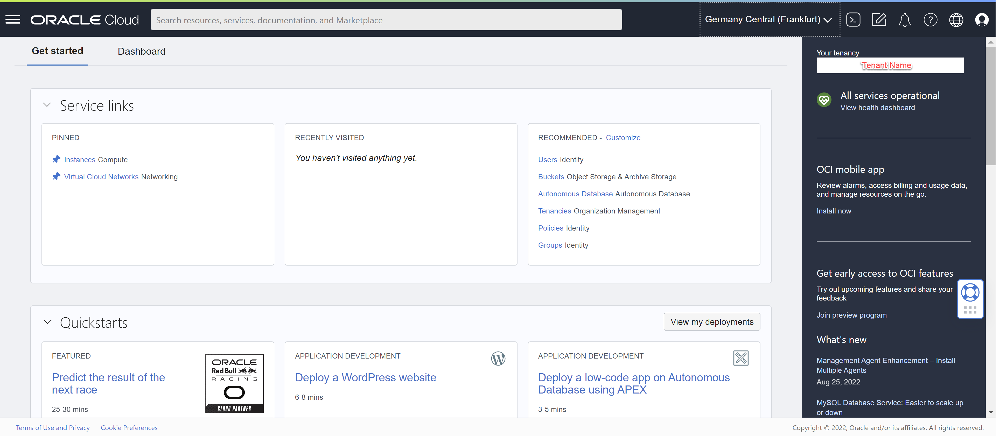

# Login

Ziel ist das Login in die OCI Konsole und das finden der eigenen Einstellungen wie Compartment und Region.

- URL: <https://console.eu-frankfurt-1.oraclecloud.com/>
- Tenant: wird noch bekanntgegeben
- Username: wird noch bekannt gegeben
- Passwort: das Initialpassword wird noch bekannt gegeben und muss bei der ersten Anmeldung geändert werden.

## URL OCI Konsole

Browser (Chrome/Firefox/Opera bevorzugt): <https://console.eu-frankfurt-1.oraclecloud.com/>

## Login als Direct-Sign-In - kein SSO

## Dashboard für die Region eu-frankfurt-01

