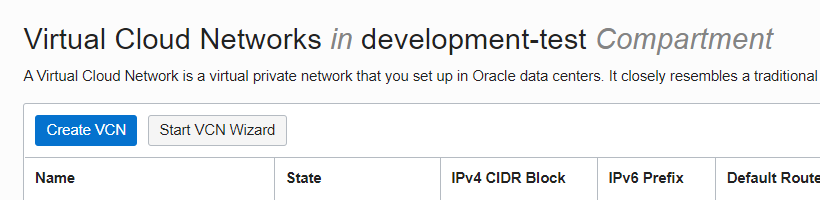
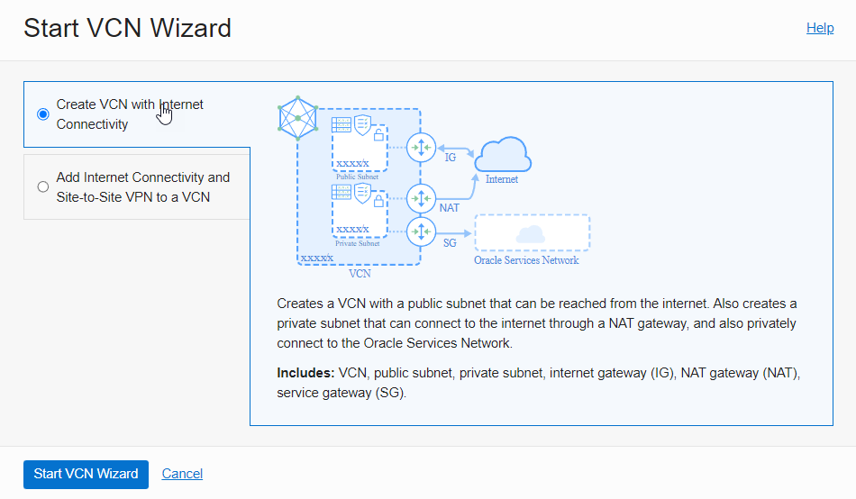
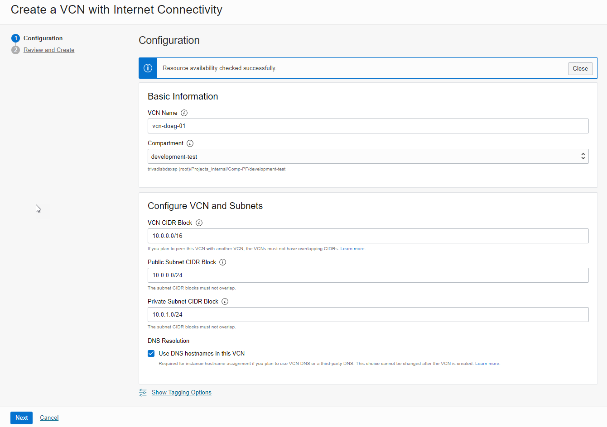
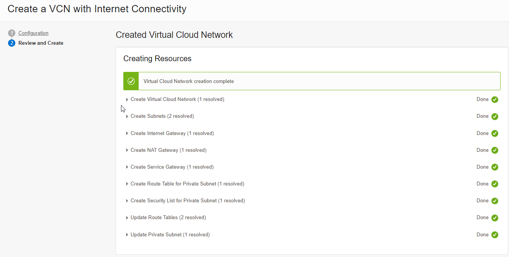
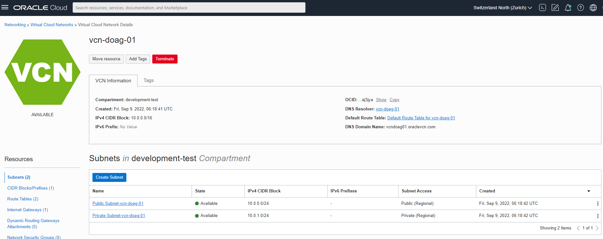
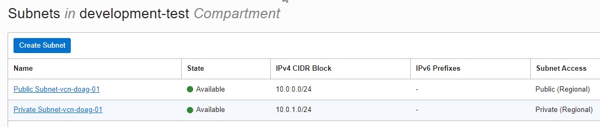
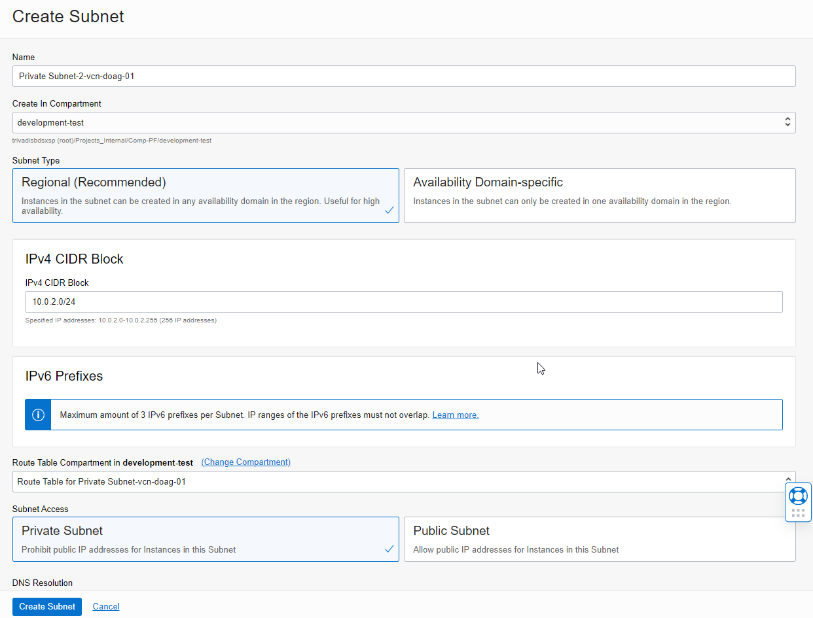
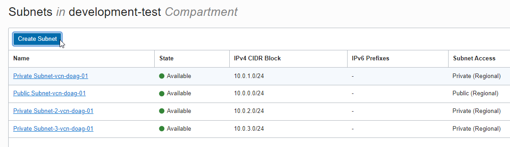

<!-- markdownlint-disable MD033 -->

# VCN-Quickstart

## Ziel: Erstellen eines Netzwerks zur weiteren Verwendung und erweitern durch zwei Subnetze

- Networking -> Virtual Cloud Networks
- Bitte beachten Sie, dass  Sie sich im korrekten Compartment befinden

Das virtuelle Netzwerk mit Hilfe vom Wizard erstellt beinhaltet:

- 2 Subnetze, 1 Public und 1 Private
- Internet Gateway
- NAT Gateway
- Service Gateway

### Start VCN Wizard

### Create a VCN with Internet Connectivity

### VCN Details ausfüllen

Die Default-Daten lassen, Next, Review und Create. Das VCN wird unmittelbar erstellt.

| Item                         | Value             | Bemerkungen  |
|:-----------------------------|:------------------|:-------------|
| VCN Name                     | vcn-doag-01       | keine        |
| Compartment                  | <Compartment>     | keine        |
| VCN CIDR Block               | 10.0.0.0/16       | keine        |
| Public Subnet CIDR Block     | 10.0.0.0/24       | keine        |
| Private Subnet CIDR Block    | 10.0.1.0/24       | keine        |

Zusammenfassung

Die Ansicht im OCI Dashboard.

## Hinzufügen zwei weiterer privaten Subnetze

| Item                         | Value                               | Bemerkungen  |
|:-----------------------------|:------------------------------------|:-------------|
| Name                         | Private Subnet-2-vcn-doag-01        | keine        |
| Create In Compartment        | <Compartment>                       | keine        |
| Subnet Type                  | Regional                            | keine        |
| IPv4 CIDR Block              | 10.0.2.0/24                         | keine        |
| Route Table Compartment      | Route Table for Private Subnet xy   | keine        |
| Subnet Access                | Subnet Access                       | keine        |
| Security Lists               | Security List for Private Subnet xy | keine        |

Wiederholen Sie den Schritt und erstellen das vierte Subnetz:

| Item                         | Value                               | Bemerkungen  |
|:-----------------------------|:------------------------------------|:-------------|
| Name                         | Private Subnet-3-vcn-doag-01        | keine        |
| Create In Compartment        | <Compartment>                       | keine        |
| IPv4 CIDR Block              | 10.0.3.0/24                         | keine        |

## Die erstellten Netze

Es gibt:

- 1 Public Regional Network
- 3 Private Regional Network

