<!-- markdownlint-disable MD033 -->
<!-- markdownlint-disable MD013 -->
# Compute

## SSH Key in der Cloud Console erstellen

Login in die Oracle Cloud Infrastructure Cloud Console und starten der Cloud Shell. Für eine bessere Lesbarkeit
kann die Terminalgrösse angepasst werden.

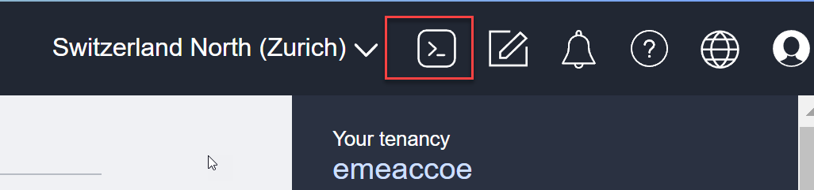

Erstellen Sie einen SSH-Key im neu erstellten Unterverzeichnis .ssh, kein Passwortschutz vom Key.

```bash
mkdir .ssh
cd .ssh
ssh-keygen -b 2048 -t rsa -f id_rsa_student01
```


Es wurden zwei Files erstellt:

- id_rsa_student01 - das ist der Private Key
- id_rsa_student01.pub - das ist der Public Key

Der Inhalt vom Public Key wird später zum Erstellen von Compute Instances benötigt. Kopieren Sie den ganzen Inhalt
in ein lokales Textfile oder Ablage.

```bash
cd .ssh
cat id_rsa_student01.pub
```

## Compute Instance - Maschine im Public Subnet erstellen

_Create Instance_ auswählen. Beachten Sie das richtige Compartment und die Region Germany Central (Frankfurt).

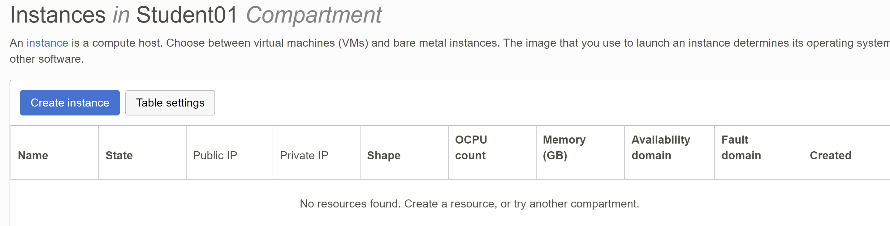

| Item                         | Value                                | Bemerkungen  |
|:-----------------------------|:-------------------------------------|:-------------|
| Name                         | ci-doag-student-01-public            | keine        |
| Placement                    | AD3                                  | keine        |
| Shape                        | Reduzieren auf 4GB                   | keine        |
| Virtual Cloud Network        | vcn-doag-student-01                  | keine        |
| Subnet                       | sn-doag-student-01-public (Regional) | keine        |
| Private IP Address           | 10.0.1.10                            | keine        |
| Hostname                     | ci-doag-student-01-public            | keine        |
| Public IP address            | Assign a public IPv4 address         | keine        |
| SSH keys                     | Public SSH Key aus der Cloud Shell   | keine        |

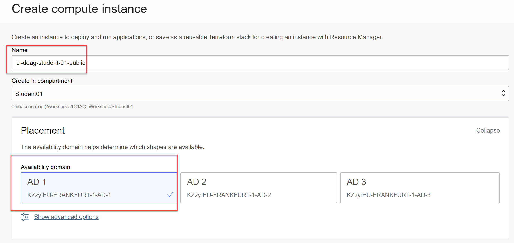

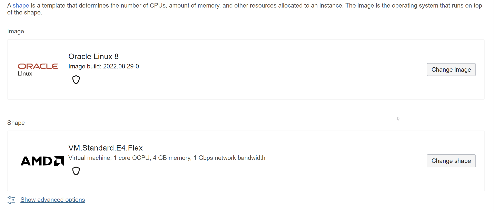

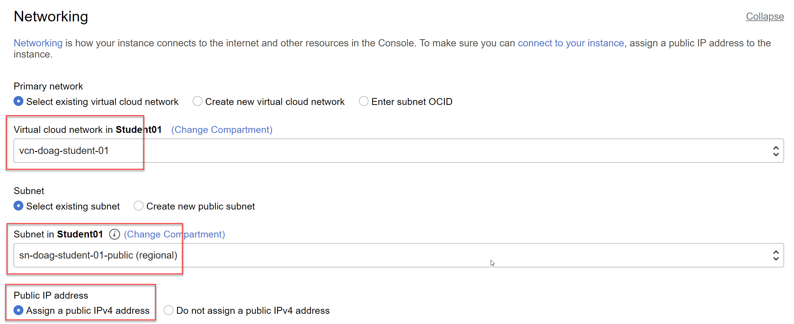

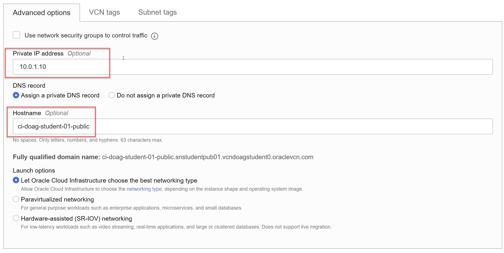

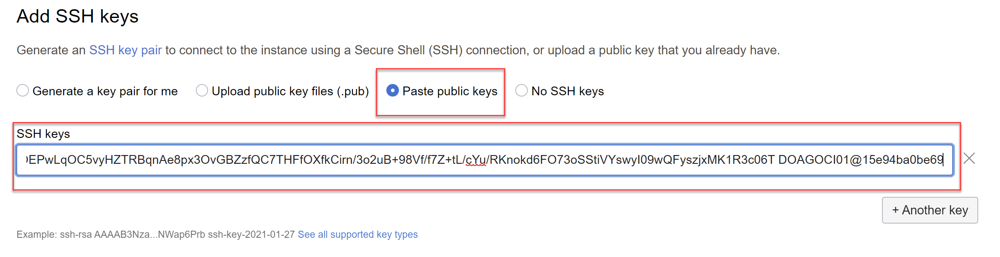

Die restlichen Einstellungen belassen, mit Klick auf _Create_ wird die Resource erstellt und anschliessend angezeigt. Notieren Sie
die Public und Private IP.

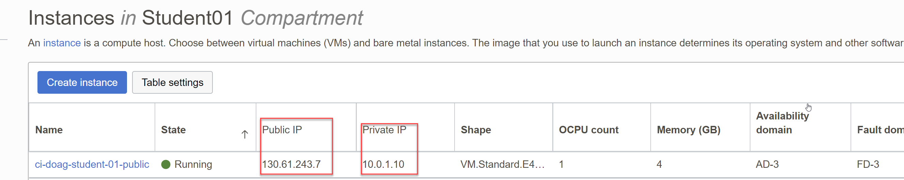

### SSH-Verbindung von der Cloud Console zur Public IP

 Starten Sie die Cloud Console. Der OS User für die Compute Instance heisst _opc_ und hat sudo-Berechtigungen. Es
 wird der private SSH Key und die Public IP benötigt.

 ```bash
ssh -i ~.ssh/id_rsa_student01 opc@130.61.243.7
exit
```

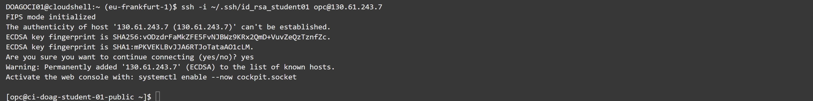

### SSH-Verbindung von der Cloud Console zur Private IP

Wechseln Sie in der Cloud Console das Netzwerk auf Private und wählen das Public Subnet aus. Der OS User für die Compute Instance heisst _opc_ und hat sudo-Berechtigungen. Es wird der private SSH Key und die Private IP benötigt.

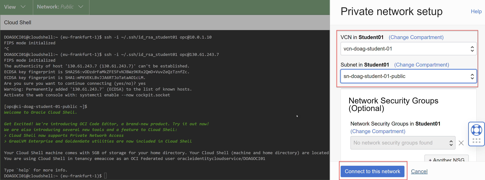

 ```bash
ssh -i ~.ssh/id_rsa_student01 opc@10.0.1.10
```

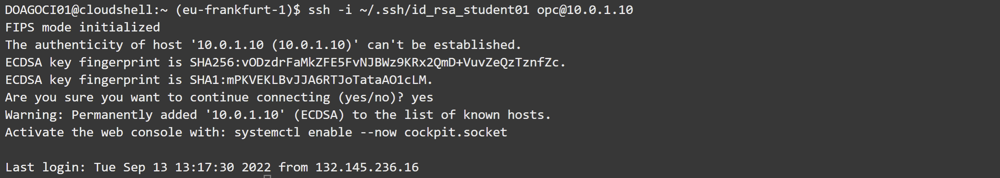

Bleiben Sie zur Installation vom Apache Webserver mit der Compute Instance als User _opc_ verbunden.

## Webserver Installation

 ```bash
# Package Installation
sudo yum install httpd -y
sudo apachectl start
sudo systemctl enable httpd
 ```

```bash
# Apache Konfiguration
sudo apachectl configtest
sudo bash -c 'echo Das ist mein DOAG-Webserver in der Oracle Cloud Infrastructure >> /var/www/html/index.html'

```

```bash
# Firewall Konfiguration
sudo firewall-cmd --permanent --zone=public --add-service=http
sudo firewall-cmd --reload
```

```bash
# Check
sudo netstat -tulnp | grep httpd
```

### Test Erreichbarkeit vom Webserver

Verwenden Sie dazu die Public IP und ihren Browser der Workstation. URL: http://<ihre Public IP>

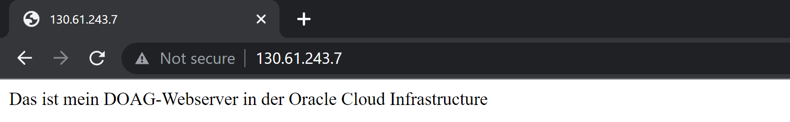

Schliessen Sie die Cloud Console.

## Compute Instance - Zwei Maschinen im Private Subnet erstellen

Erstellen Sie zwei Compute Instances im Private Subnet der Applikationen. Installieren und Konfigurieren
Sie Apache für das spätere Loadbalancer Setup in der Cloud Shell via Private IP.

### Webserver LB1

| Item                         | Value                                      | Bemerkungen  |
|:-----------------------------|:-------------------------------------------|:-------------|
| Name                         | ci-doag-student-01-lb-1                    | keine        |
| Placement                    | AD1                                        | keine        |
| Shape                        | Reduzieren auf 4GB                         | keine        |
| Virtual Cloud Network        | vcn-doag-student-01                        | keine        |
| Subnet                       | sn-doag-student-01-private-app (Regional)  | keine        |
| Private IP Address           | 10.0.2.10                                  | keine        |
| Hostname                     | ci-doag-student-01-lb-1                    | keine        |
| Public IP address            | Do not assign a public IPv4 address        | keine        |
| SSH keys                     | Public SSH Key aus der Cloud Shell         | keine        |

Index html-File

```bash
sudo bash -c 'echo Das ist mein DOAG-Webserver 1 in der Oracle Cloud Infrastructure >> /var/www/html/index.html'
```

### Webserver LB2

| Item                         | Value                                      | Bemerkungen  |
|:-----------------------------|:-------------------------------------------|:-------------|
| Name                         | ci-doag-student-01-lb-2                    | keine        |
| Placement                    | AD2                                        | keine        |
| Shape                        | Reduzieren auf 4GB                         | keine        |
| Virtual Cloud Network        | vcn-doag-student-01                        | keine        |
| Subnet                       | sn-doag-student-01-private-app (Regional)  | keine        |
| Private IP Address           | 10.0.2.11                                  | keine        |
| Hostname                     | ci-doag-student-01-lb-2                    | keine        |
| Public IP address            | Do not assign a public IPv4 address        | keine        |
| SSH keys                     | Public SSH Key aus der Cloud Shell         | keine        |

Index html-File

```bash
sudo bash -c 'echo Das ist mein DOAG-Webserver 2 in der Oracle Cloud Infrastructure >> /var/www/html/index.html'
```


Schliessen Sie die Cloud Console.

### Load Balancer Konfiguration

_Networking_ -> _Load Balancer_ - einen neuen Load Balancer erstellen.


| Item                         | Value                                      | Bemerkungen  |
|:-----------------------------|:-------------------------------------------|:-------------|
| Load Balancer Name           | lb-doag-student-01                         | keine        |
| Visibility Type              | Public                                     | keine        |
| Virtual Cloud Network        | vcn-doag-student-01                        | keine        |
| Subnet                       | sn-doag-student-01-public                  | keine        |
| Load Balancing Policy        | Weighted Round Robin                       | keine        |
| Listener Name                | ls-doag-student-01                         | keine        |
| Type of Traffic              | http                                       | keine        |
| Public IP address            | Do not assign a public IPv4 address        | keine        |
| SSH keys                     | Public SSH Key aus der Cloud Shell         | keine        |

### Load Balancer Konfiguration - Add Details


_Next_.

### Load Balancer Konfiguration - Choose Backends

_Add Backends_ um die Webserver hinzuzufügen. Port bleibt auf 80. Die Webserver auswählen und _Add Selected Backends_ anklicken.


_Next_.

### Load Balancer Konfiguration - Configure Listener


_Next_.

### Load Balancer Konfiguration - Manage Logging

Access Logs aktivieren. Die restlichen Einstellungen behalten. Mit Klick auf _Submit_ wird die Resource erstellt.


_Submit_. Die Erstellung dauert ca. 5-10 Minuten. Der Health Check wird nach ein
paar Minuten auf grün gesetzt werden sofern die Webserver korrekt konfigurtiert sind.

Tip: Meistens scheitert es an fehlenden oder falschen Firewall-Einstellungen auf der Maschine oder in der OCI Security List.


### Test Erreichbarkeit Webserver via Loadbalancer

Verwenden Sie dazu die Load Balancer Public IP und ihren Browser der Workstation. URL: http://<ihre Public IP>.

Tip: Meistens scheitert es an fehlenden oder falschen Firewall-Einstellungen auf der Maschine oder in der OCI Security List.


Nach dem Browser-Refresh:


