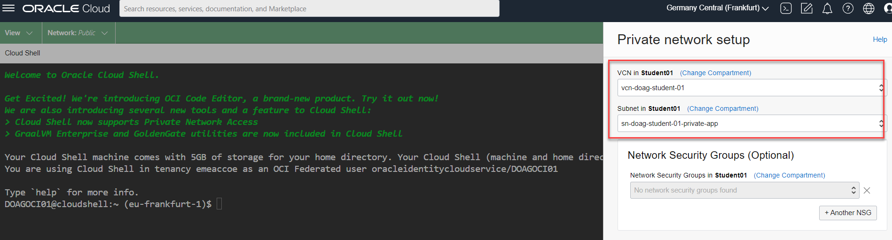

<!-- markdownlint-disable MD033 -->
<!-- markdownlint-disable MD013 -->
# Database

Ziel ist die Bereitstellung einer Oracle Datenbank in der Availability Domain 2 Region Frankfurt.

_Oracle Database_ -> _Oracle Base Database (VM, BM)_ -> um eine Datenbank bereit zu stellen.
_Create DB system_ anklicken.


## DB system information

| Item                                | Value                                    | Bemerkungen  |
|:------------------------------------|:-----------------------------------------|:-------------|
| Name                                | dbsys-doag-student-01                    | keine        |
| Placement                           | AD2                                      | keine        |
| Storage management software         | Logical Volume Manager                   | keine        |
| Storage volume performance          | Balanced                                 | keine        |
| Shape Type                          | Virtual Machine                          | keine        |
| Shape                               | VM.Standard.E4.Flex - 2 core OCPU, 32    | keine        |
| Oracle Database software edition    | Standard Edition                         | keine        |
| Add SSH keys                        | <Public Key>                             | keine        |
| License type                        | License included                         | keine        |
| Virtual cloud network               | vcn-doag-student-01                      | keine        |
| Client subnet                       | sn-doag-student-01-private-db            | keine        |
| Hostname prefix                     | dbsys01                                  | keine        |
| Private IP address                  | 10.0.3.50                                | keine        |


Die restlichen Einstellungen belassen, _Next_.

## Database information

| Item                                | Value                                    | Bemerkungen  |
|:------------------------------------|:-----------------------------------------|:-------------|
| Database name                       | DBDOAG01                                 | keine        |
| PDB name                            | pdbdoag01                                | keine        |
| Password                            | SYS-Password                             | keine        |
| Confirm password                    | SYS-Password                             | keine        |


Die restlichen Einstellungen belassen, mit Klick auf _Create DB system_ wird die Resource erstellt und anschliessend angezeigt. Die Erstellung dauert ca. 30 Minuten.


### SSH-Verbindung von der Cloud Console zur Database Private IP

Stellen Sie sicher das die Cloud Console das Netzwerk auf Private eingestellt hat. Der OS User für die Database Instance heisst _opc_ und hat sudo-Berechtigungen. Es wird der private SSH Key und die Private IP benötigt.

```bash
[oracle@dbsys01 ~]$ ssh -i ~.ssh/id_rsa_student01 opc@10.0.3.50
```


Wechseln Sie um OS User oracle and setzen Sie die Umgebungsvariablen. Prüfen Sie, ob der PMON-Prozess
läuft.

```bash
[oracle@dbsys01 ~]$ sudo su - oracle
[oracle@dbsys01 ~]$ ps -ef | grep pmon
```

Verbinden Sie als SYSDBA zur Pluggable Database. Der Service-Name ist mit _lsnrctl_ zu sehen.

```bash
# Service Name anzeigen
[oracle@dbsys01 ~]$ lsnrctl status | grep pdbdoag01
Service "pdbdoag01.snstudentprv02.vcndoagstudent0.oraclevcn.com" has 1 instance(s).

# Easy Connect
[oracle@dbsys01 ~]$ sqlplus sys@//dbsys01/pdbdoag01.snstudentprv02.vcndoagstudent0.oraclevcn.com as sysdba

SQL*Plus: Release 19.0.0.0.0 - Production on Wed Sep 14 12:58:56 2022
Version 19.16.0.0.0

Copyright (c) 1982, 2022, Oracle.  All rights reserved.

Enter password: 

Connected to:
Oracle Database 19c Standard Edition 2 Release 19.0.0.0.0 - Production
Version 19.16.0.0.0

SQL> SELECT * FROM global_name;

GLOBAL_NAME
--------------------------------------------------------------------------------
PDBDOAG01.SNSTUDENTPRV02.VCNDOAGSTUDENT0.ORACLEVCN.COM

```

### SQL*Net Verbindung von der Private Compute Instance zur Database Private IP

Stellen Sie sicher das die Cloud Console das Netzwerk auf das Subnet der Applikation eingestellt hat.



Der OS User für die Compute Instance heisst _opc_ und hat sudo-Berechtigungen. Es wird der private SSH Key und die Private IP benötigt.

```bash
ssh -i ~.ssh/id_rsa_student01 opc@10.0.2.10
```


Bleiben Sie zur Installation vom Oracle Instant Client mit der Compute Instance als User _opc_ verbunden.

```bash
sudo dnf list installed | grep instantclient
sudo dnf install oracle-instantclient-release-el8
sudo dnf install oracle-instantclient-basic
sudo dnf install oracle-instantclient-sqlplus
```

# Easy Connect vom Applikationsserver

Da der DNS-Name aktuell nicht bekannt ist, verwenden wir die IP vom Datenbankserver.

```bash
[oracle@dbsys01 ~]$ sqlplus sys@//10.0.3.50/pdbdoag01.snstudentprv02.vcndoagstudent0.oraclevcn.com as sysdba

SQL*Plus: Release 19.0.0.0.0 - Production on Wed Sep 14 12:58:56 2022
Version 19.16.0.0.0

Copyright (c) 1982, 2022, Oracle.  All rights reserved.

Enter password:

Connected to:
Oracle Database 19c Standard Edition 2 Release 19.0.0.0.0 - Production
Version 19.16.0.0.0

SQL> SELECT * FROM global_name;

GLOBAL_NAME
--------------------------------------------------------------------------------
PDBDOAG01.SNSTUDENTPRV02.VCNDOAGSTUDENT0.ORACLEVCN.COM

```
