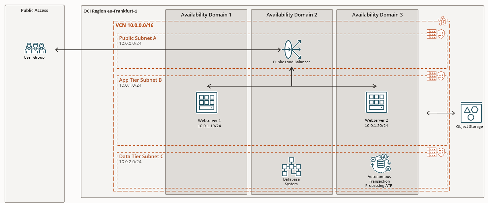

<!-- markdownlint-disable MD041 -->
# OCI Walkthrough

## Architektur

Gemeinsam bauen wir folgende Infrastruktur in der *Region Germany Central (Frankfurt)*:

- Virtual Cloud Network VCN
- Compute Instances mit Public Load Balancer
- Database Service
- Eine Verbindung von der Compute Instance zur Oracle Datenbank
- Eine Autonomous Database ATP
- Upload zum OCI Object Storage

Weiter zur nächsten Aufgabe [OCI Login](./1x02-Login.md) oder zurück zur [Übersicht](../README.md).
