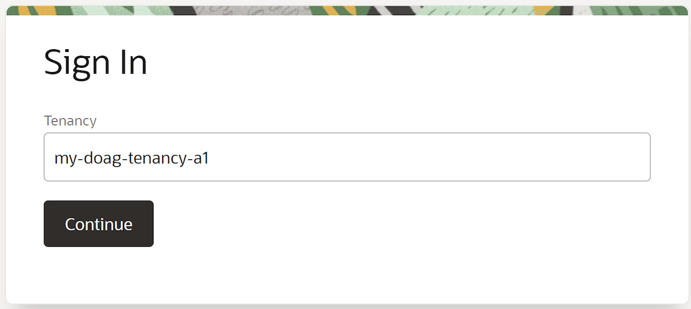
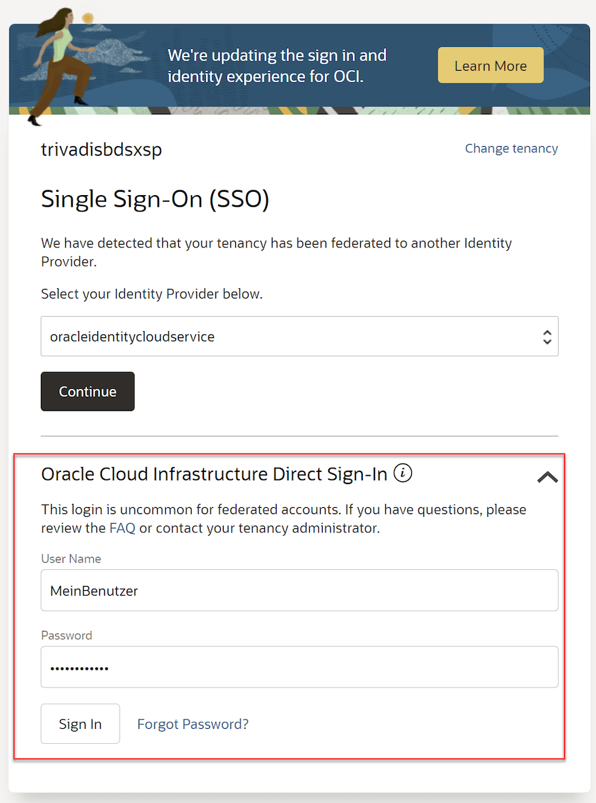

<!-- markdownlint-disable MD013 -->
<!-- markdownlint-disable MD025 -->
<!-- markdownlint-disable MD033 -->
<!-- markdownlint-disable MD041 -->
## OCI Konsole Login

### Übungsziele {.unlisted .unnumbered}

Ziel ist das Login in die OCI Konsole und das finden der eigenen Einstellungen wie Compartment und Region.

### Aufgaben {.unlisted .unnumbered}

Login in die OCI Konsole mit folgenden Angaben / Informationen.

- **URL:** <a href="https://console.eu-frankfurt-1.oraclecloud.com" target="_blank" rel="noopener">OCI Konsole Frankfurt - Login</a>
- **Tenant:** wird noch bekanntgegeben
- **Username:** wird noch bekannt gegeben
- **Passwort:** das Initiale Password wird noch bekannt gegeben und muss bei der ersten Anmeldung geändert werden.

### URL OCI Konsole

Browser (Chrome/Firefox/Opera bevorzugt): <a href="https://console.eu-frankfurt-1.oraclecloud.com" target="_blank" rel="noopener">OCI Konsole Frankfurt - Login</a>

### Login als Direct-Sign-In - kein SSO

### Dashboard für die Region eu-frankfurt-01

Ihr Tenant ist auf dem Dashboard in der Region oben-rechts ersichtlich.

