<!-- markdownlint-disable MD013 -->
<!-- markdownlint-disable MD025 -->
<!-- markdownlint-disable MD033 -->
<!-- markdownlint-disable MD041 -->
## VCN-Basics

### Übungsziele {.unlisted .unnumbered}

Erstellen eines Netzwerks zur weiteren Verwendung

- Networking -> Virtual Cloud Networks
- Bitte beachten Sie, dass  Sie sich in ihrem zugewiesenen Compartment befinden
- Region ist eu-frankfurt-1
- Wir verwenden nicht den VCN Wizard.

### Aufgaben {.unlisted .unnumbered}

Das virtuelle Netzwerk wird Schritt für Schritt erstellt:

- 1 VCN
- 1 Internet Gateway
- 1 NAT Gateway
- 1 Routing Table für Public Subnet
- 1 Routing Table für Private Subnet
- 1 Security List für Public Subnet
- 1 Security List für Private Subnet
- 1 Public Subnet
- 2 Private Subnet

::: note
**Hinweise** Die hier aufgeführten Schritte werden im Compartment *Student01*
ausgeführt und heissen auch dementsprechend. Ersetzen Sie die Nummer mit der
Ihnen zugewiesenen Nummer 01-0n.
:::

### VCN Erstellen

*Create VCN* auswählen, wir verwenden nicht den VCN Wizard.

| Item                         | Value               | Bemerkungen  |
|:-----------------------------|:--------------------|:-------------|
| Name                         | vcn-doag-student-01 | keine        |
| IPv4 CIDR Blocks             | 10.0.0.0/16         | keine        |

Table: VCN Konfigurationsvorgaben

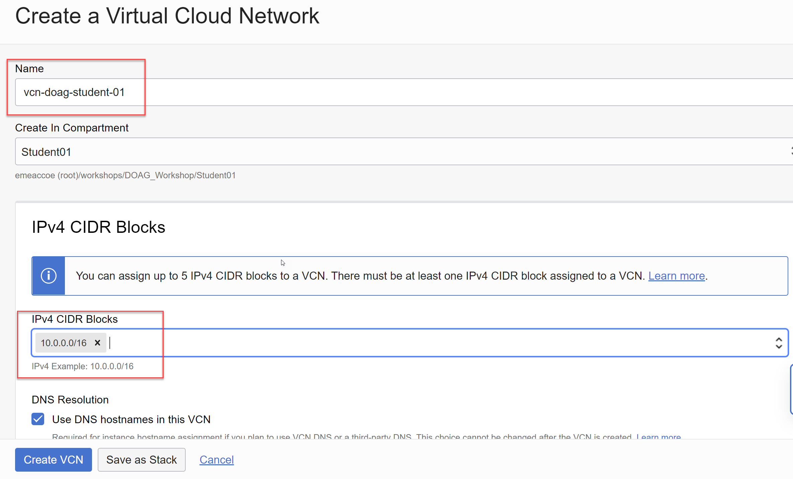

Die restlichen Einstellungen belassen, mit Klick auf *Create VCN* wird die Resource erstellt und anschliessend angezeigt.

### Internet Gateway Erstellen

Im erstellten VCN die Resource *Internet Gateways* auswählen, *Create Internet Gateway*.

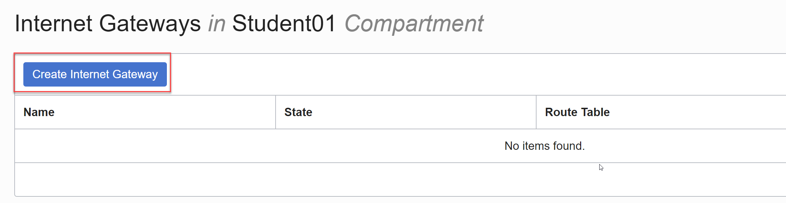

| Item                         | Value               | Bemerkungen  |
|:-----------------------------|:--------------------|:-------------|
| Name                         | igw-doag-student-01 | keine        |

Table: Internet Gateways Konfigurationsvorgaben

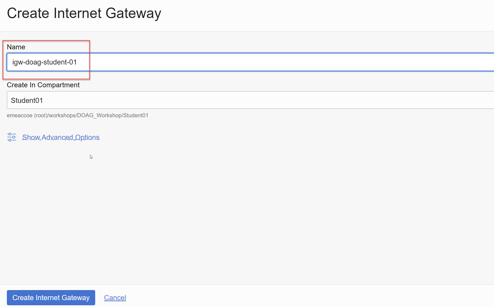

Die restlichen Einstellungen belassen, mit Klick auf *Create Internet Gateway* wird die Resource erstellt und anschliessend angezeigt.

### NAT Gateway Erstellen

Im erstellten VCN die Resource *NAT Gateways* auswählen, *Create NAT Gateway*.

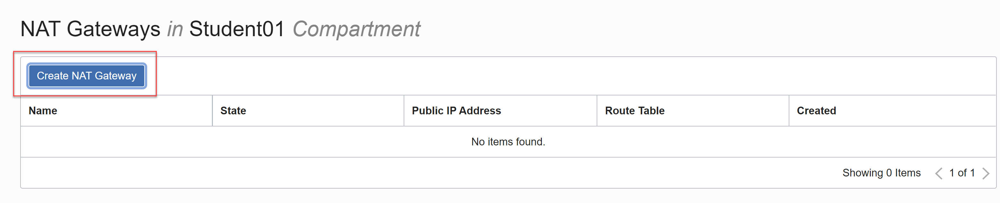

| Item                         | Value               | Bemerkungen  |
|:-----------------------------|:--------------------|:-------------|
| Name                         | ngw-doag-student-01 | keine        |

Table: NAT Gateways Konfigurationsvorgaben

Die restlichen Einstellungen belassen, mit Klick auf *Create NAT Gateway* wird die Resource erstellt und anschliessend angezeigt.

### Routing Table für Public Subnet

Die Route beinhaltet das Internet Gateway. Im erstellten VCN die Resource *Route Tables* auswählen, *Create Route Table*.

| Item                         | Value                      | Bemerkungen  |
|:-----------------------------|:---------------------------|:-------------|
| Name                         | rt-doag-student-01-public  | keine        |

Table: Public Routing Table Konfigurationsvorgaben

Fügen Sie folgende Route hinzu:

| Target Type                  | Value                      | Bemerkungen  |
|:-----------------------------|:---------------------------|:-------------|
| Internet Gateway             | rt-doag-student-01-public  | keine        |
| Destination CIDR Block       | 0.0.0.0/0                  | keine        |
| Target Internet Gateway      | igw-doag-student-01        | keine        |

Table: Public Routing Table Konfigurationsvorgaben

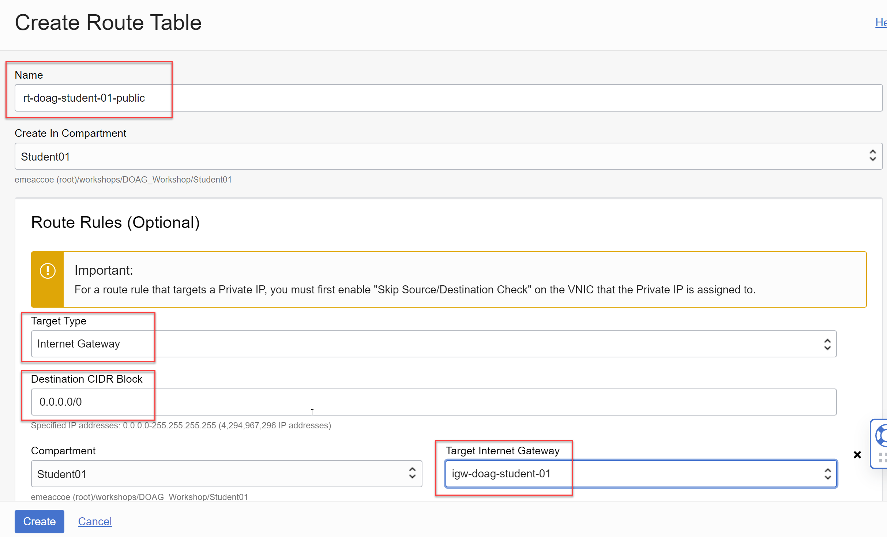

Die restlichen Einstellungen belassen, mit Klick auf *Create* wird die Resource erstellt und anschliessend angezeigt.

### Routing Table für Private Subnet

Die Route beinhaltet das NAT Gateway. Im erstellten VCN die Resource *Route Tables* auswählen, *Create Route Table*.

| Item                         | Value                      | Bemerkungen  |
|:-----------------------------|:---------------------------|:-------------|
| Name                         | rt-doag-student-01-private | keine        |

Table: Private Routing Table Konfigurationsvorgaben

Fügen Sie folgende Route hinzu:

| Target Type                  | Value                   | Bemerkungen  |
|:-----------------------------|:------------------------|:-------------|
| NAT      Gateway             | rt-doag-student-private | keine        |
| Destination CIDR Block       | 0.0.0.0/0               | keine        |
| Target NAT Gateway           | ngw-doag-student-01     | keine        |

Table: Private Routing Table Konfigurationsvorgaben

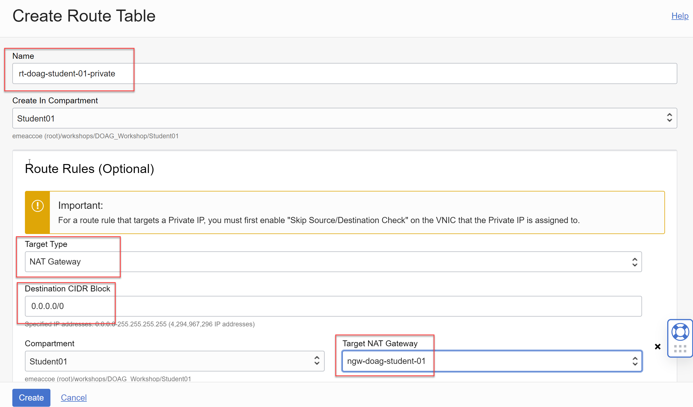

Die restlichen Einstellungen belassen, mit Klick auf *Create* wird die Resource erstellt und anschliessend angezeigt.

### Security List für Public Subnet

Die Security List lässt Zugriff auf das Public Subnet von den Ports 22 (SSH) und 80 (http) zu.
Im erstellten VCN die Resource *Security Lists* auswählen, *Create Security List*.

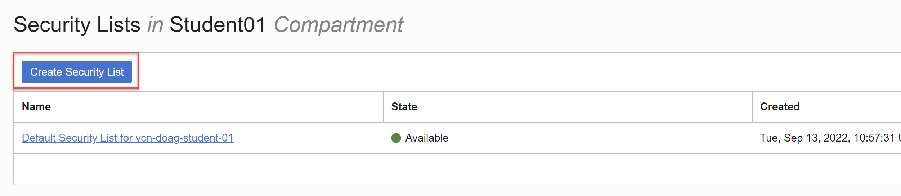

| Item                         | Value                      | Bemerkungen  |
|:-----------------------------|:---------------------------|:-------------|
| Name                         | sl-doag-student-01-public  | keine        |

Table: Public Subnet Konfigurationsvorgaben

Fügen Sie folgende Ingress-Regeln hinzu:

| Destination                  | Source Type & CIDR   | Port    | Protocol    |
|:-----------------------------|:---------------------|:--------|:------------|
| Ingress                      | CIDR 0.0.0.0/0       | 22      | TCP         |
| Ingress                      | CIDR 0.0.0.0/0       | 80      | TCP         |

Table: Ingress-Regeln Public Subnet

Fügen Sie folgende Egress-Regeln hinzu:

| Destination                  | Source Type & CIDR   | Port    | Protocol    |
|:-----------------------------|:---------------------|:--------|:------------|
| Egress                       | CIDR 0.0.0.0/0       | All     | All         |

Table: Egress-Regeln Public Subnet

Die restlichen Einstellungen belassen, mit Klick auf *Create Security List* wird die Resource erstellt und anschliessend angezeigt.

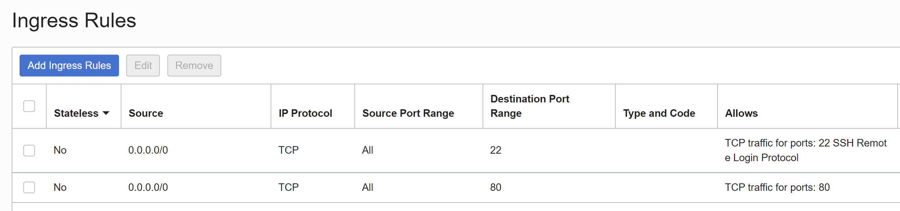
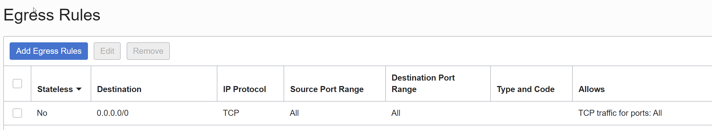

### Security List für Private Subnet

Die Security List lässt Zugriff auf das Private Subnet von den Ports 22 (SSH) und 1521 (sqlnet) aus dem Public Subnet zu.
Im erstellten VCN die Resource *Security Lists* auswählen, *Create Security List*.

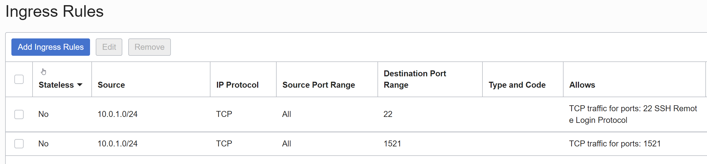

| Item                         | Value                      | Bemerkungen  |
|:-----------------------------|:---------------------------|:-------------|
| Name                         | sl-doag-student-01-private | keine        |

Table: Private Subnet Konfigurationsvorgaben

Fügen Sie folgende Ingress-Regeln hinzu:

| Destination                  | Source Type & CIDR   | Port    | Protocol    |
|:-----------------------------|:---------------------|:--------|:------------|
| Ingress                      | CIDR 10.0.0.0/16     | 22      | TCP         |
| Ingress                      | CIDR 10.0.0.0/16     | 80      | TCP         |

Table: Ingress-Regeln

Fügen Sie folgende Egress-Regeln hinzu:

| Destination                  | Source Type & CIDR   | Port    | Protocol    |
|:-----------------------------|:---------------------|:--------|:------------|
| Egress                       | CIDR 0.0.0.0/0       | All     | All         |

Table: Egress-Regeln

Die restlichen Einstellungen belassen, mit Klick auf *Create Security List* wird die Resource erstellt und anschliessend angezeigt.

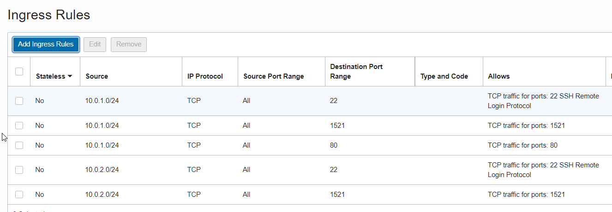
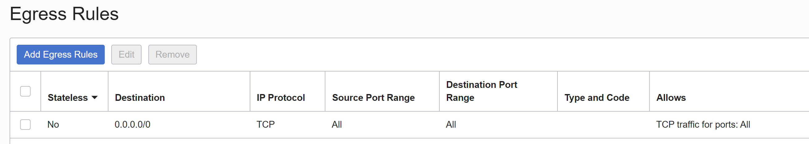

### Public Subnet

Im erstellten VCN die Resource *Subnets* auswählen, *Create Subnet*.

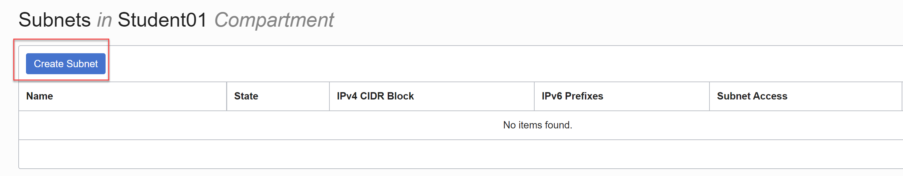

| Item                         | Value                     | Bemerkungen  |
|:-----------------------------|:--------------------------|:-------------|
| Name                         | sn-doag-student-01-public | keine        |
| Subnet Type                  | Regional                  | keine        |
| IPv4 CIDR Block              | 10.0.1.0/24               | keine        |
| Subnet Access                | Public                    | keine        |
| DNS Label                    | snstudentpub01            | keine        |
| Route Table                  | rt-doag-student-public    | keine        |
| DHCP Options                 | Default DHCP Options      | keine        |
| Security Lists               | sl-doag-student-01-public | keine        |

Table: Public Subnet Konfiguration

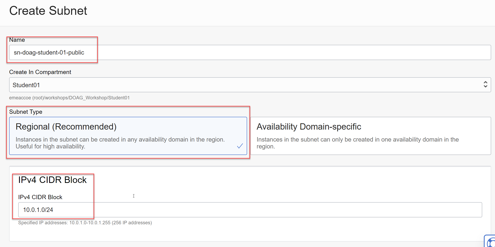
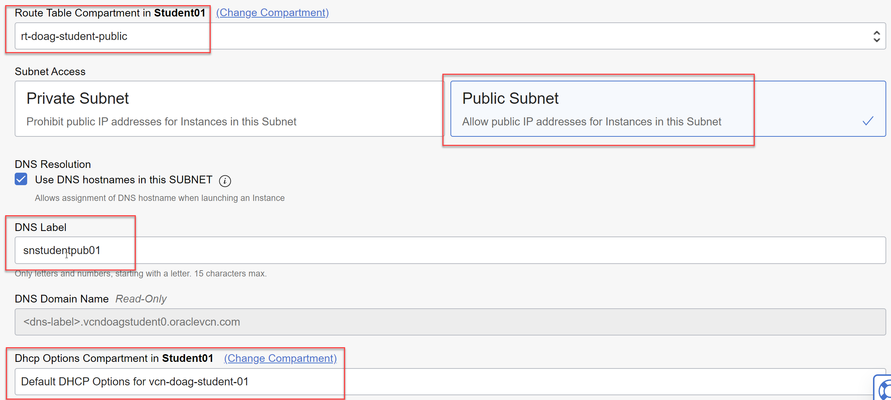

Die restlichen Einstellungen belassen, mit Klick auf *Create Subnet* wird die Resource erstellt und anschliessend angezeigt.

### Private Subnets

Im erstellten VCN die Resource *Subnets* auswählen, *Create Subnet*.

| Item                         | Value                          | Bemerkungen  |
|:-----------------------------|:-------------------------------|:-------------|
| Name                         | sn-doag-student-01-private-app | keine        |
| Subnet Type                  | Regional                       | keine        |
| IPv4 CIDR Block              | 10.0.2.0/24                    | keine        |
| Subnet Access                | Private                        | keine        |
| DNS Label                    | snstudentprv01                 | keine        |
| Route Table                  | rt-doag-student-private        | keine        |
| DHCP Options                 | Default DHCP Options           | keine        |
| Security Lists               | sl-doag-studet-01-private      | keine        |

Table: Private Subnet Konfiguration I

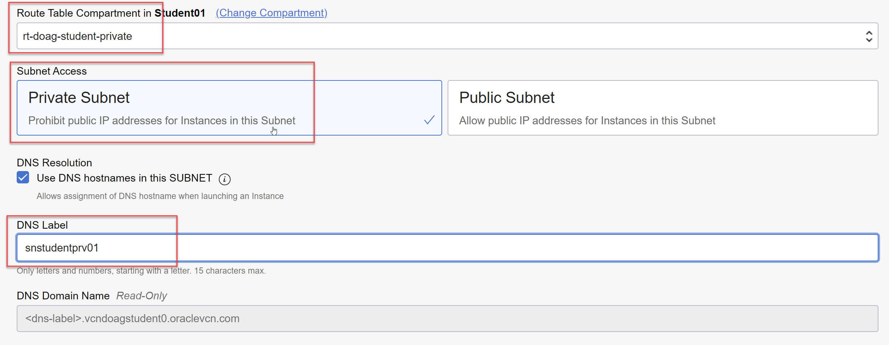
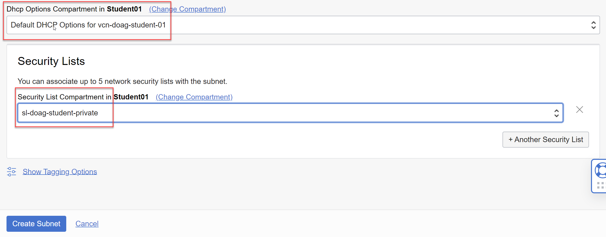

Die restlichen Einstellungen belassen, mit Klick auf *Create Subnet* wird die Resource erstellt und anschliessend angezeigt.

Wiederholen Sie die Erstellen für das zweite private Subnet.

| Item                         | Value                          | Bemerkungen  |
|:-----------------------------|:-------------------------------|:-------------|
| Name                         | sn-doag-student-01-private-db  | keine        |
| Subnet Type                  | Regional                       | keine        |
| IPv4 CIDR Block              | 10.0.3.0/24                    | keine        |
| Subnet Access                | Private                        | keine        |
| DNS Label                    | snstudentprv02                 | keine        |
| Route Table                  | rt-doag-student-private        | keine        |
| DHCP Options                 | Default DHCP Options           | keine        |
| Security Lists               | sl-doag-student-01-private     | keine        |

Table: Private Subnet Konfiguration II

Übersicht der erstellten Subnets:

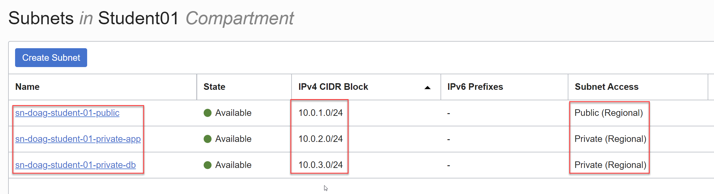
