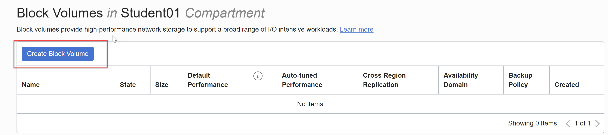
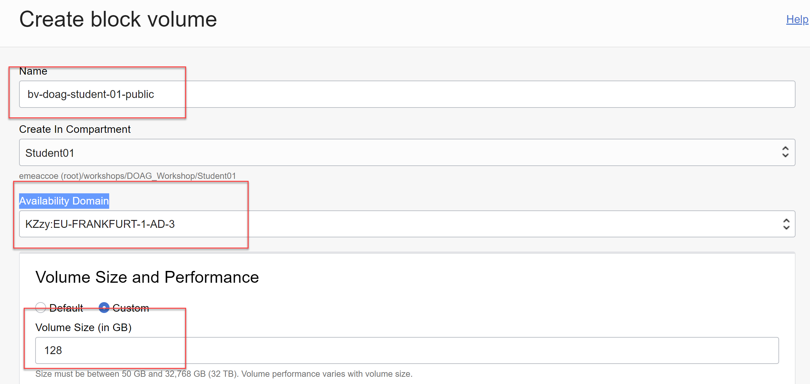
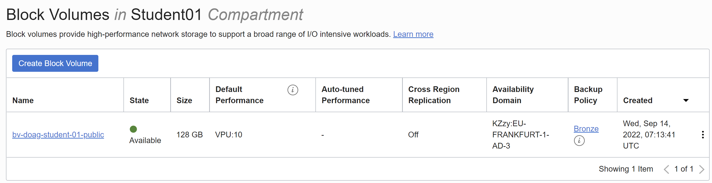
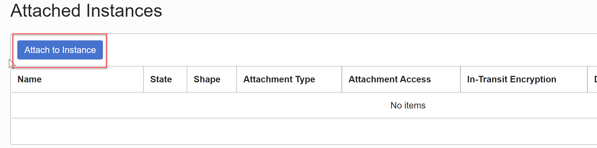
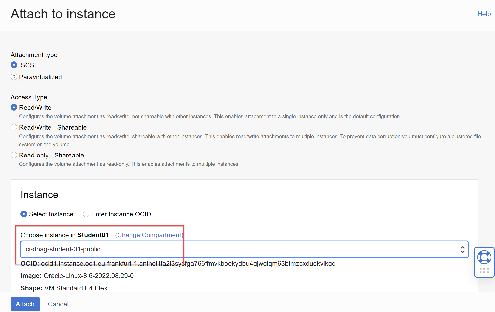
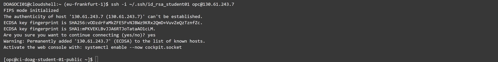

<!-- markdownlint-disable MD013 -->
<!-- markdownlint-disable MD025 -->
<!-- markdownlint-disable MD033 -->
<!-- markdownlint-disable MD041 -->
## Compute Instance mit Block Volume

### Übungsziele {.unlisted .unnumbered}

Block Volume erstellen uns als iSCSI an der Public Compute Instance anhängen

### Aufgaben {.unlisted .unnumbered}

- Erstellen Sie ein Block Volume
- hängen Sie das Block Volume an die Instanz an
- Partitionieren und formatieren Sie die neu angehängte Disk.

### Block Volume erstellen

Beachten Sie die Einstellung für die Availability Domain, ansonsten ist das Block Volume
für die Compute Instant nicht verfügbar.

_Block Storage_ -> _Block Volume_



| Item                         | Value                                      | Bemerkungen  |
|:-----------------------------|:-------------------------------------------|:-------------|
| Name                         | bv-doag-student-01-public                  | keine        |
| AD                           | AD3                                        | keine        |
| Volume Size (in GB)          | 128GB                                      | keine        |
| Select Backup Policy         | Bronze                                     | keine        |



Die restlichen Einstellungen belassen, mit Klick auf _Create Block Volume_ wird die Resource erstellt und anschliessend angezeigt.



### Block Volume am Compute Instance anhängen

Block Volume auswählen, _Resources_ -> _Attached Instances_ -> _Attach to Instance_. Stellen Sie
sicher das die Compute Instance im Public Subnet läuft im Status "Running". Ansonsten kann das
Block Volume nicht angehängt werden.



Wählen Sie die Instanz aus.



Die restlichen Einstellungen belassen, mit Klick auf _Attach_ wird die Resource angehängt. Für
die weitere Verwendung muss auf Stufe OS das Device gemounted werden.

### SSH-Verbindung von der Cloud Console zur Public IP

 Starten Sie die Cloud Console und sterllen Sie sicher, dass das Netzwekr auf _Public Network_ eingestellt ist. Der OS User für die Compute Instance heisst _opc_ und hat sudo-Berechtigungen. Es  wird der private SSH Key und die Public IP benötigt.

 Sollte die Cloud Shell nach der Umstellung nicht reagieren, kurz neu Starten in _View_ -> _Restart_.

 ```bash
ssh -i ~.ssh/id_rsa_student01 opc@130.61.243.7
```



### iSCSI Disk anhängen und formatieren

Die iSCSI Kommandi müssen von den Block Volume Informationen kopiert werden und ist unterschiedlich.

 ```bash
# Bestehende Disks anzeigen
[opc@ci-doag-student-01-public ~]$ sudo lsblk
NAME               MAJ:MIN RM  SIZE RO TYPE MOUNTPOINT
sda                  8:0    0 46.6G  0 disk 
├─sda1               8:1    0  100M  0 part /boot/efi
├─sda2               8:2    0    1G  0 part /boot
└─sda3               8:3    0 45.5G  0 part 
  ├─ocivolume-root 252:0    0 35.5G  0 lvm  /
  └─ocivolume-oled 252:1    0   10G  0 lvm  /var/oled

# Disk anhängen
sudo iscsiadm -m node -o new -T iqn.2015-12.com.oracleiaas:9f3f6986-4e7d-40c3-89e8-897b7350f34f -p 169.254.2.2:3260
sudo iscsiadm -m node -o update -T iqn.2015-12.com.oracleiaas:9f3f6986-4e7d-40c3-89e8-897b7350f34f -n node.startup -v automatic
sudo iscsiadm -m node -T iqn.2015-12.com.oracleiaas:9f3f6986-4e7d-40c3-89e8-897b7350f34f -p 169.254.2.2:3260 -l

# Die neue Disk wird als Device sdb angezeigt
[opc@ci-doag-student-01-public ~]$ sudo lsblk
NAME               MAJ:MIN RM  SIZE RO TYPE MOUNTPOINT
sda                  8:0    0 46.6G  0 disk 
├─sda1               8:1    0  100M  0 part /boot/efi
├─sda2               8:2    0    1G  0 part /boot
└─sda3               8:3    0 45.5G  0 part 
  ├─ocivolume-root 252:0    0 35.5G  0 lvm  /
    └─ocivolume-oled 252:1    0   10G  0 lvm  /var/oled
sdb                  8:16   0  128G  0 disk 

# Disk formatieren mit ext4
[opc@ci-doag-student-01-public ~]$ sudo mkfs.xfs /dev/sdb

# Verzeichnis anlegen
[opc@ci-doag-student-01-public ~]$ sudo mkdir /mnt/data 

# Device UUID anzeigen mit blkid
[opc@ci-doag-student-01-public ~]$ sudo blkid /dev/sdb
/dev/sdb: UUID="89245bdd-8cfb-48f4-9a6a-5e21771b5098" BLOCK_SIZE="4096" TYPE="ext4"

# In /etc/fstab eintragen
[opc@ci-doag-student-01-public ~]$ sudo vi /etc/fstab

- Shift+G
- Alt-O

UUID=89245bdd-8cfb-48f4-9a6a-5e21771b5098 /mnt/data xfs defaults,noatime,_netdev 0 0

- ESC
-:
- wq

# Mount
[opc@ci-doag-student-01-public ~]$ sudo mount -a

# Das Device wird angezeigt und ist  verfügbar
[opc@ci-doag-student-01-public ~]$ df -m
Filesystem                 1M-blocks  Used Available Use% Mounted on
devtmpfs                        1713     0      1713   0% /dev
tmpfs                           1754     0      1754   0% /dev/shm
tmpfs                           1754     9      1745   1% /run
tmpfs                           1754     0      1754   0% /sys/fs/cgroup
/dev/mapper/ocivolume-root     36307  7945     28363  22% /
/dev/sda2                       1014   324       691  32% /boot
/dev/mapper/ocivolume-oled     10230   110     10121   2% /var/oled
/dev/sda1                        100     5        95   6% /boot/efi
tmpfs                            351     0       351   0% /run/user/0
tmpfs                            351     0       351   0% /run/user/987
tmpfs                            351     0       351   0% /run/user/1000
/dev/sdb                      131008   946    130063   1% /mnt/data
```

### OCI iSCSI Utility

Das Tool kann für iSCSI Operationen verwendet werden und ist Bestandteil der OCI
Cloud Images für Compute Instances. Für Attach/Detach/Destroy muss das OCI-CLI
installiert sein.

 ```bash
 # Details anzeigen
[opc@ci-doag-student-01-public ~]$ sudo oci-iscsi-config show --details --output-mode=text
Unable to get volume ocid and display name for iqn [iqn.2015-12.com.oracleiaas:9f3f6986-4e7d-40c3-89e8-897b7350f34f], 
Currently attached iSCSI devices:
Target: iqn.2015-12.com.oracleiaas:9f3f6986-4e7d-40c3-89e8-897b7350f34f
Volume Name: -
Volume OCID: -
Persistent Portal: 169.254.2.2:3260
Current Portal: 169.254.2.2:3260
Session State: LOGGED_IN
Attached Device: sdb
Size: 128G
Mountpoint: /mnt/data
Filesystem: xfs

Partitions:

```
