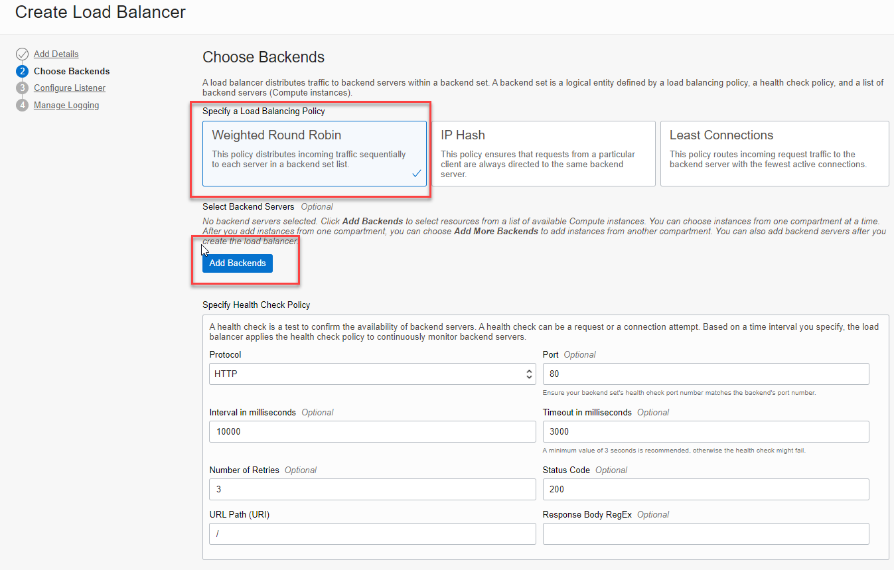

<!-- markdownlint-disable MD013 -->
<!-- markdownlint-disable MD025 -->
<!-- markdownlint-disable MD033 -->
<!-- markdownlint-disable MD041 -->
## Compute Instances mit Load Balancer

### Übungsziele {.unlisted .unnumbered}

Erstellen von zwei Compute Instance im Privaten Subnet der Applikationen und
Konfiguration eines Load Balancer für eine Web Anwendung.

### Aufgaben {.unlisted .unnumbered}

- Erstellen Sie zwei Compute Instances im Private Subnet der Applikationen
- Installieren und Konfigurieren Sie Apache
- Load balancer Setupvia in der Cloud Shell via Private IP.

### Zwei Compute Instances im Private Subnet erstellen

#### Webserver LB1

| Item                         | Value                                      | Bemerkungen  |
|:-----------------------------|:-------------------------------------------|:-------------|
| Name                         | ci-doag-student-01-lb-1                    | keine        |
| Placement                    | AD1                                        | keine        |
| Shape                        | Reduzieren auf 4GB                         | keine        |
| Virtual Cloud Network        | vcn-doag-student-01                        | keine        |
| Subnet                       | sn-doag-student-01-private-app (Regional)  | keine        |
| Private IP Address           | 10.0.2.10                                  | keine        |
| Hostname                     | ci-doag-student-01-lb-1                    | keine        |
| Public IP address            | Do not assign a public IPv4 address        | keine        |
| SSH keys                     | Public SSH Key aus der Cloud Shell         | keine        |

Index html-File für Webserver 1:

```bash
sudo bash -c 'echo Das ist mein DOAG-Webserver 1 in der Oracle Cloud Infrastructure >> /var/www/html/index.html'
```

#### Webserver LB2

| Item                         | Value                                      | Bemerkungen  |
|:-----------------------------|:-------------------------------------------|:-------------|
| Name                         | ci-doag-student-01-lb-2                    | keine        |
| Placement                    | AD2                                        | keine        |
| Shape                        | Reduzieren auf 4GB                         | keine        |
| Virtual Cloud Network        | vcn-doag-student-01                        | keine        |
| Subnet                       | sn-doag-student-01-private-app (Regional)  | keine        |
| Private IP Address           | 10.0.2.11                                  | keine        |
| Hostname                     | ci-doag-student-01-lb-2                    | keine        |
| Public IP address            | Do not assign a public IPv4 address        | keine        |
| SSH keys                     | Public SSH Key aus der Cloud Shell         | keine        |

Index html-File für Webserver 2:

```bash
sudo bash -c 'echo Das ist mein DOAG-Webserver 2 in der Oracle Cloud Infrastructure >> /var/www/html/index.html'
```


### Cloud Shell auf Private Subnet ändern

Ändern Sie in der Cloud Shell die Netzwerkkonfiguration auf Private und definieren sie das Subnet.
_Connect to this Network_. Es dauert ein paar Sekunden bis die Konifguration gemacht ist.


### Webserver einrichten

Verbinden Sie sich wie in der vorherigen Übung mit der Cloud Shell Console zu den Webservern mit
der Private IP Adresse und dem SSH-Key als User _opc_. Installieren sie auf beiden Compute Instances Apache und
erstellen Sie ein kleines HTML-File.

### Webserver Installation

 ```bash
# Package Installation
sudo yum install httpd -y
sudo apachectl start
sudo systemctl enable httpd
 ```

```bash
# Apache Konfiguration
sudo apachectl configtest
sudo bash -c 'echo Das ist mein DOAG-Webserver [n] in der Oracle Cloud Infrastructure >> /var/www/html/index.html'

```

```bash
# Firewall Konfiguration
sudo firewall-cmd --permanent --zone=public --add-service=http
sudo firewall-cmd --reload
```

```bash
# Check
sudo netstat -tulnp | grep httpd
```

### Load Balancer Konfiguration

_Networking_ -> _Load Balancer_ - einen neuen Load Balancer erstellen.


| Item                         | Value                                      | Bemerkungen  |
|:-----------------------------|:-------------------------------------------|:-------------|
| Load Balancer Name           | lb-doag-student-01                         | keine        |
| Visibility Type              | Public                                     | keine        |
| Virtual Cloud Network        | vcn-doag-student-01                        | keine        |
| Subnet                       | sn-doag-student-01-public                  | keine        |
| Load Balancing Policy        | Weighted Round Robin                       | keine        |
| Listener Name                | ls-doag-student-01                         | keine        |
| Type of Traffic              | http                                       | keine        |
| Public IP address            | Do not assign a public IPv4 address        | keine        |
| SSH keys                     | Public SSH Key aus der Cloud Shell         | keine        |

#### Load Balancer Konfiguration - Add Details


_Next_.

#### Load Balancer Konfiguration - Choose Backends

_Add Backends_ um die Webserver hinzuzufügen. Port bleibt auf 80. Die Webserver auswählen und _Add Selected Backends_ anklicken.




_Next_.

#### Load Balancer Konfiguration - Configure Listener


_Next_.

#### Load Balancer Konfiguration - Manage Logging

Access Logs aktivieren. Die restlichen Einstellungen behalten. Mit Klick auf _Submit_ wird die Resource erstellt.


_Submit_. Die Erstellung dauert ca. 5-10 Minuten. Der Health Check wird nach ein
paar Minuten auf grün gesetzt werden sofern die Webserver korrekt konfigurtiert sind.

Tip: Meistens scheitert es an fehlenden oder falschen Firewall-Einstellungen auf der Maschine oder in der OCI Security List.


### Test Erreichbarkeit Webserver via Load Balancer

Verwenden Sie dazu die Load Balancer Public IP und ihren Browser der Workstation. URL: <http://ihre-load-balancer-public-ip>

Tip: Meistens scheitert es an fehlenden oder falschen Firewall-Einstellungen auf der Maschine oder in der OCI Security List.
Prüfen Sie den Zustand der Backends im Health Check.


Nach dem Browser-Refresh:


