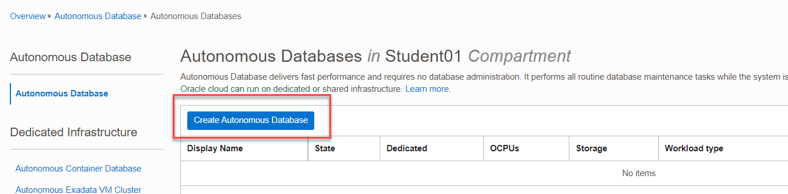
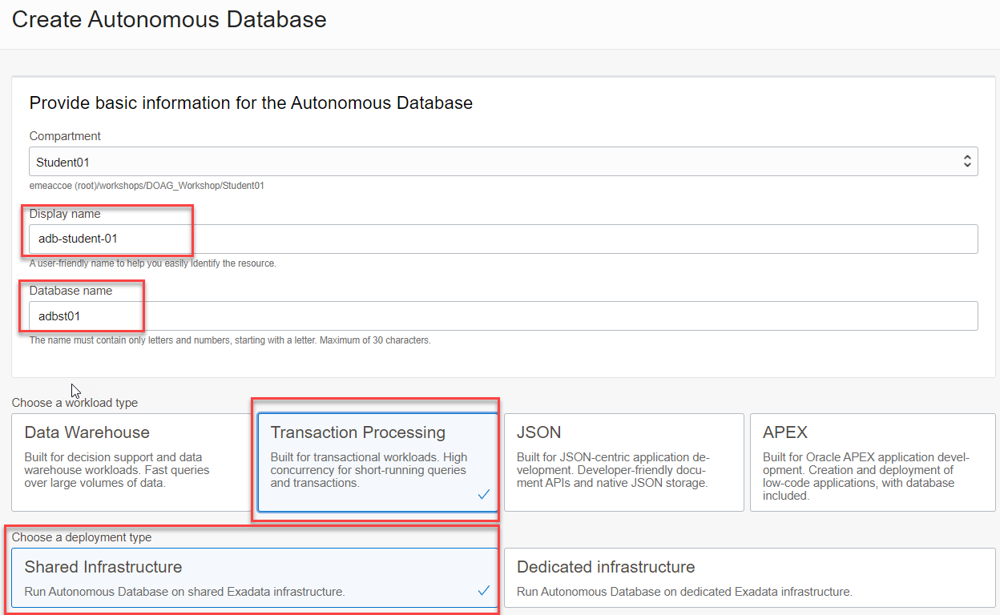
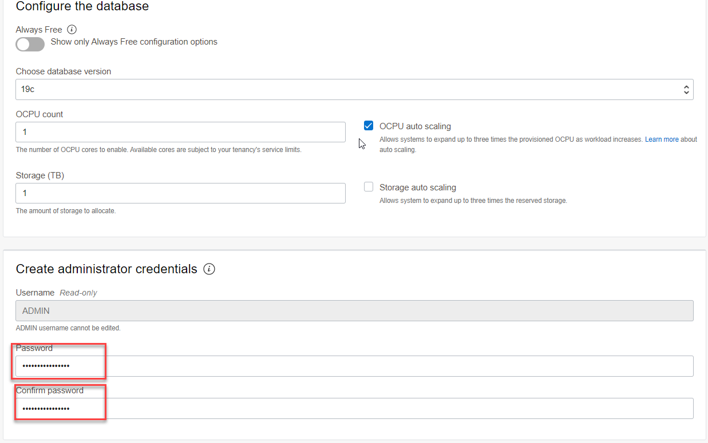
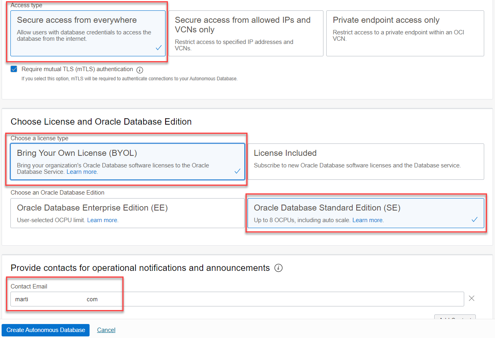
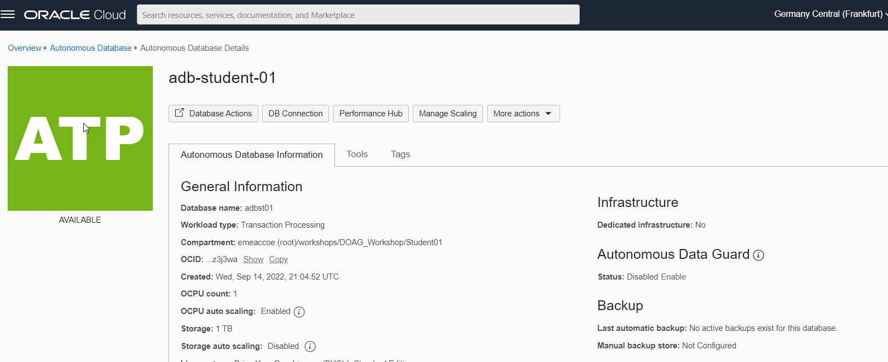
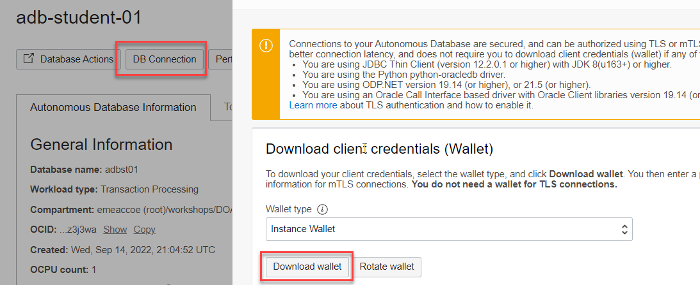
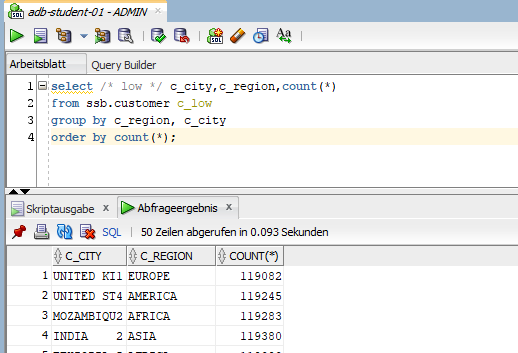

<!-- markdownlint-disable MD013 -->
<!-- markdownlint-disable MD025 -->
<!-- markdownlint-disable MD033 -->
<!-- markdownlint-disable MD041 -->
## Autonomous Database

### Übungsziele {.unlisted .unnumbered}

Ziel ist die Bereitstellung einer Autonomous Database Autonomous Transaction Processing [ATP].

### Aufgaben {.unlisted .unnumbered}

- Erstellen Sie eine Autonomous Database
- Verbinden Sie zur Autonomous Database mit einem Wallet

# Autonomous Database erstellen

_Oracle Database_ -> _Autonomous Database_ -> _Create Autonomous Database_. Stellen Sie sicher,
dass Sie sich im korrekten Compartment befinden.



## Provide basic information for the Autonomous Database

| Item                                | Value                                    | Bemerkungen  |
|:------------------------------------|:-----------------------------------------|:-------------|
| Display name                        | adb-student-01                           | keine        |
| Database name                       | adbst01                                  | keine        |
| Workload type                       | Transaction Processing                   | keine        |
| Deployment type                     | Shared Infrastructure                    | keine        |
| Password                            | ADMIN Passwort                           | keine        |
| Confirm Password                    | ADMIN Passwort                           | keine        |
| Access type                         | Secure access from everywhere            | keine        |
| License type                        | BYOL                                     | keine        |
| Oracle Database Edition             | Oracle Database Standard Edition (SE)    | keine        |
| Contact Email                       | Eine gültige Mailadresse                 | keine        |





Die restlichen Einstellungen belassen, _Create Autonomous Database_. Sie erhalten ein E-Mail
wenn die ATP bereit ist.



## SQL Developer Connect

Verbinden Sie ihren lokalen SQL Developer mit der ATP. Dazu muss das File mit den Connection-Informationen runtergeladen
werden. Wichtig: Das File muss nicht entpackt werden.

_ADB_ -> _DB Connection_ -> _Download Wallet_



### SQL Developer einrichten

 Starten Sie ihren lokalen SQL Developer and legen Sie eine neue Verbindung an.

| Item                                | Value                                    | Bemerkungen  |
|:------------------------------------|:-----------------------------------------|:-------------|
| Benutzername                        | ADMIN                                    | keine        |
| Kennwort                            | ADMIN Passwort                           | keine        |
| Verbindungstyp                      | Cloud Wallet                             | keine        |
| Konfigurationsdatei                 | Die Wallet-Zip Datei                     | keine        |
| Password                            | ADMIN Passwort                           | keine        |

Testen Sie die Verbindung und Speichern Sie sie.

{:width="900px"}


Die Autonomous Database steht zur Verwendung bereit. Testen Sie das Demo Dataset im Schema _SSB_.

```bash
select /* low */ c_city,c_region,count(*)
from ssb.customer c_low
group by c_region, c_city
order by count(*);
```



Weitere Schema Queries: <https://docs.oracle.com/en/cloud/paas/autonomous-database/adbsa/sample-queries.html#GUID-431A16E8-4C4D-4786-BE5C-30029AC1EFD8>

Upload ATP Wallet to OCI Cloud Console und dann weiter zur Private Compute Instance. Die OCI Console muss auf _Network:Public_ gesetzt sein. Wenn das File nicht ersichtlich ist nach dem Upload, kurz die OCI Cloud Console neu starten.


```bash
scp -i ~/.ssh/id_rsa_student01 Wallet_adbst01.zip opc@130.61.243.7:/home/opc
ssh -i ~/.ssh/id_rsa_student01 opc@130.61.243.7
```

```bash
sudo yum makecache fast
sudo yum -y install java-1.8.0-openjdk-headless.x86_64
```

```bash
curl http://www.dominicgiles.com/site_downloads/swingbenchlatest.zip -o swingbench.zip
unzip swingbench.zip

[opc@ci-doag-student-01-lb-1 ~]$ ll
total 40276
drwx------. 12 opc opc      161 Mar 16  2022 swingbench
-rw-rw-r--.  1 opc opc 41211958 Sep 15 14:48 swingbench.zip
-rw-r--r--.  1 opc opc    26437 Sep 15 14:44 Wallet_adbst01.zip

```

<https://github.com/oracle/learning-library/blob/master/oci-library/L100-LAB/ATP_Lab/ATP_HOL.md#practice-3-create-atp-instance-in-oci-and-configure-swing-bench-on-compute-instance-to-generate-load-traffic>

```bash
cd swingbench/bin

./oewizard -cf /home/opc/Wallet_ATP01.zip -cs atp01_medium -ts DATA -dbap Oracle098Ax12w -dba ADMIN -u soe -p Oracle098Ax12w -async_off -scale 0.2 -hashpart -create -cl -v

./sbutil -soe -cf /home/opc/Wallet_ATP01.zip -cs atp01_medium -u soe -p Oracle098Ax12w -tables

./sbutil -soe -cf /home/opc/Wallet_adbst01.zip -cs adbst01_medium -u soe -p Oracle098Ax12w -tables
Operation is successfully completed.
Operation is successfully completed.
Order Entry Schemas Tables
+----------------------+-----------+--------+---------+-------------+--------------+
| Table Name           | Rows      | Blocks | Size    | Compressed? | Partitioned? |
+----------------------+-----------+--------+---------+-------------+--------------+
| ORDERS               | 285,958   | 32,192 | 256.0MB |             | Yes          |
| ADDRESSES            | 300,000   | 32,192 | 256.0MB |             | Yes          |
| LOGON                | 476,597   | 32,192 | 256.0MB |             | Yes          |
| CARD_DETAILS         | 300,000   | 32,192 | 256.0MB |             | Yes          |
| ORDER_ITEMS          | 1,431,767 | 32,192 | 256.0MB |             | Yes          |
| CUSTOMERS            | 200,000   | 32,192 | 256.0MB |             | Yes          |
| INVENTORIES          | 898,969   | 2,386  | 19.0MB  | Disabled    | No           |
| PRODUCT_DESCRIPTIONS | 1,000     | 35     | 320KB   | Disabled    | No           |
| PRODUCT_INFORMATION  | 1,000     | 28     | 256KB   | Disabled    | No           |
| WAREHOUSES           | 1,000     | 5      | 64KB    | Disabled    | No           |
| ORDERENTRY_METADATA  | 0         | 0      | 64KB    | Disabled    | No           |
+----------------------+-----------+--------+---------+-------------+--------------+
                                Total Space     1.5GB

```

```bash
sed -i -e 's/<LogonGroupCount>1<\/LogonGroupCount>/<LogonGroupCount>5<\/LogonGroupCount>/' \
       -e 's/<LogonDelay>0<\/LogonDelay>/<LogonDelay>300<\/LogonDelay>/' \
       -e 's/<WaitTillAllLogon>true<\/WaitTillAllLogon>/<WaitTillAllLogon>false<\/WaitTillAllLogon>/' \
       ../configs/SOE_Server_Side_V2.xml

```

```bash
curl -s checkip.dyndns.org | sed -e 's/.*Current IP Address: //' -e 's/<.*$//'
```
