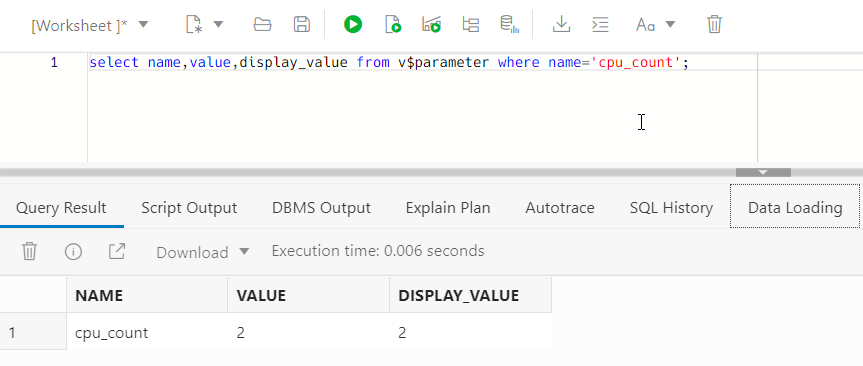

<!-- markdownlint-disable MD013 -->
<!-- markdownlint-disable MD025 -->
<!-- markdownlint-disable MD033 -->
<!-- markdownlint-disable MD041 -->
## Autonomous Database

### Übungsziele {.unlisted .unnumbered}

Ziel ist die Bereitstellung einer Autonomous Database Autonomous Transaction Processing [ATP].

### Aufgaben {.unlisted .unnumbered}

- Erstellen Sie eine Autonomous Database
- Verbinden Sie zur Autonomous Database mit einem Wallet

### Autonomous Database erstellen

_Oracle Database_ -> _Autonomous Database_ -> _Create Autonomous Database_. Stellen Sie sicher,
dass Sie sich im korrekten Compartment befinden.

{:width="900px"}

### Grundlegende Informationen für die Autonomous Database bereitstellen

| Item                                | Value                                    | Bemerkungen  |
|:------------------------------------|:-----------------------------------------|:-------------|
| Display name                        | adb-student-01                           | keine        |
| Database name                       | adbst01                                  | keine        |
| Workload type                       | Transaction Processing                   | keine        |
| Deployment type                     | Shared Infrastructure                    | keine        |
| Password                            | ADMIN Passwort                           | keine        |
| Confirm Password                    | ADMIN Passwort                           | keine        |
| Access type                         | Secure access from everywhere            | keine        |
| License type                        | License Included                         | keine        |
| Oracle Database Edition             | Oracle Database Standard Edition (SE)    | keine        |
| Contact Email                       | Eine gültige Mailadresse                 | keine        |

{:width="900px"}
{:width="900px"}
{:width="900px"}

Die restlichen Einstellungen belassen, _Create Autonomous Database_. Sie erhalten ein E-Mail
wenn die ATP bereit ist.

{:width="900px"}

### SQL Developer Connect

Verbinden Sie ihren lokalen SQL Developer mit der ATP. Dazu muss das File mit den Connection-Informationen runtergeladen
werden. Wichtig: Das File muss nicht entpackt werden.

_ADB_ -> _DB Connection_ -> _Download Wallet_

{:width="900px"}

### Optional: SQL Developer einrichten

 Starten Sie ihren lokalen SQL Developer and legen Sie eine neue Verbindung an.

| Item                                | Value                                    | Bemerkungen  |
|:------------------------------------|:-----------------------------------------|:-------------|
| Benutzername                        | ADMIN                                    | keine        |
| Kennwort                            | ADMIN Passwort                           | keine        |
| Verbindungstyp                      | Cloud Wallet                             | keine        |
| Konfigurationsdatei                 | Die Wallet-Zip Datei                     | keine        |
| Password                            | ADMIN Passwort                           | keine        |

Testen Sie die Verbindung und Speichern Sie sie.

{:width="900px"}

Die Autonomous Database steht zur Verwendung bereit. Testen Sie das Demo Dataset im Schema _SSB_.

```bash
select /* low */ c_city,c_region,count(*)
from ssb.customer c_low
group by c_region, c_city
order by count(*);
```

Weitere Schema Queries: <https://docs.oracle.com/en/cloud/paas/autonomous-database/adbsa/sample-queries.html#GUID-431A16E8-4C4D-4786-BE5C-30029AC1EFD8>

{:width="400px"}

### Swingbench in der Public Compute Instance konfigurieren und ausführen

Upload ATP Wallet to OCI Cloud Console (oben rechts beim Zahrad) und dann weiter zur Private Compute Instance. Die OCI Console muss auf _Network:Public_ gesetzt sein. Wenn das File nicht ersichtlich ist nach dem Upload, kurz die OCI Cloud Console neu starten.

```bash
scp -i ~/.ssh/id_rsa_student01 Wallet_adbst01.zip opc@130.61.243.7:/home/opc
ssh -i ~/.ssh/id_rsa_student01 opc@130.61.243.7
```

Auf der Public Compute Instance muss nun das Wallet ersichtlich sein.

```bash
$ ls -l
total 28
-rw-r--r--. 1 opc opc 26432 Sep 21 08:45 Wallet_adbst01.zip
```

### JDK installieren - wird für Swingbench benötigt

```bash
# JDK 17 download und Installation
wget https://download.java.net/java/GA/jdk17.0.2/dfd4a8d0985749f896bed50d7138ee7f/8/GPL/openjdk-17.0.2_linux-x64_bin.tar.gz
sudo tar xvf openjdk-17.0.2_linux-x64_bin.tar.gz
sudo mv jdk-17.0.2/ /opt/jdk-17/

# Shell Script anlegen
sudo tee /etc/profile.d/set-jdk.sh <<EOF
export JAVA_HOME=/opt/jdk-17
export PATH=\$PATH:\$JAVA_HOME/bin
EOF

# Umgebung setzen und Version prüfen
source /etc/profile.d/set-jdk.sh

$ java -version
openjdk version "17.0.2" 2022-01-18
OpenJDK Runtime Environment (build 17.0.2+8-86)
OpenJDK 64-Bit Server VM (build 17.0.2+8-86, mixed mode, sharing)

```

### Swingbench herunterladen und installieren

```bash
# Download vom OCI Object Store und entpacken
curl https://objectstorage.eu-zurich-1.oraclecloud.com/p/a6Ctsdw-2QBqSn4UxTxvwCuUT2-I5hwrySLxeDECaGYd1tonWN-gTR4Cq1YrxTLE/n/zrrioivzmxcn/b/swingbench/o/swingbench24062022.zip -o swingbench.zip

unzip swingbench.zip

# Verzeichnisinhalt
$ ll
-rw-rw-r--.  1 opc opc 187033144 Dec 27  2021 openjdk-17.0.2_linux-x64_bin.tar.gz
drwx------. 12 opc opc      4096 Jun 24 13:52 swingbench
-rw-rw-r--.  1 opc opc  37822106 Sep 21 08:48 swingbench.zip
-rw-r--r--.  1 opc opc     26432 Sep 21 08:45 Wallet_adbst01.zip

```

### Daten generieren

```bash
# In das Unterverzeichnis wechseln um Daten zu generieren für das Schema SOE
cd swingbench/bin

# Das Passwort für den User SOE ist auf Oracle098Ax12w gesetzt
# Für DBAP das gesetzte ADB-Passwort verwenden
./oewizard -cf /home/opc/Wallet_adbst01.zip -cs adbst01_medium -ts DATA -dbap Oracle098Ax12w -dba ADMIN -u soe -p Oracle098Ax12w -async_off -scale 0.2 -hashpart -create -cl -v
```

### Daten verifizieren

```bash
# Anzeige der geladenen Testdaten
./sbutil -soe -cf /home/opc/Wallet_adbst01.zip -cs adbst01_medium -u soe -p Oracle098Ax12w -tables

Operation is successfully completed.
Operation is successfully completed.
Order Entry Schemas Tables
+----------------------+-----------+--------+---------+-------------+--------------+
| Table Name           | Rows      | Blocks | Size    | Compressed? | Partitioned? |
+----------------------+-----------+--------+---------+-------------+--------------+
| CUSTOMERS            | 200,000   | 32,192 | 256.0MB |             | Yes          |
| ADDRESSES            | 300,000   | 32,192 | 256.0MB |             | Yes          |
| CARD_DETAILS         | 300,000   | 32,192 | 256.0MB |             | Yes          |
| ORDERS               | 285,958   | 32,192 | 256.0MB |             | Yes          |
| LOGON                | 476,597   | 32,192 | 256.0MB |             | Yes          |
| ORDER_ITEMS          | 1,412,453 | 32,192 | 256.0MB |             | Yes          |
| INVENTORIES          | 901,660   | 2,512  | 20.0MB  | Disabled    | No           |
| PRODUCT_DESCRIPTIONS | 1,000     | 35     | 320KB   | Disabled    | No           |
| PRODUCT_INFORMATION  | 1,000     | 28     | 256KB   | Disabled    | No           |
| ORDERENTRY_METADATA  | 0         | 0      | 64KB    | Disabled    | No           |
| WAREHOUSES           | 1,000     | 5      | 64KB    | Disabled    | No           |
+----------------------+-----------+--------+---------+-------------+--------------+
                                Total Space     1.5GB
```

### Swingbench Login Rate anpassen

```bash
sed -i -e 's/<LogonGroupCount>1<\/LogonGroupCount>/<LogonGroupCount>5<\/LogonGroupCount>/' \
       -e 's/<LogonDelay>0<\/LogonDelay>/<LogonDelay>300<\/LogonDelay>/' \
       -e 's/<WaitTillAllLogon>true<\/WaitTillAllLogon>/<WaitTillAllLogon>false<\/WaitTillAllLogon>/' \
       ../configs/SOE_Server_Side_V2.xml

```

### Benchmark für 5 Minuten

```bash
# Der Parameter -rt regelt die Laufzeit
./charbench -c ../configs/SOE_Server_Side_V2.xml -cf /home/opc/Wallet_adbst01.zip  -cs atbst01_medium -u soe -p Oracle098Ax12w -v users,tpm,tps,vresp -intermin 0 -intermax 0 -min 0 -max 0 -uc 128 -di SQ,WQ,WA -rt 0:5
```

- If OCPU Auto-Scaling is disabled and running on one OCPU, TPS - Transactions per Second - is about 700-1500 TPM
- If OCPU Auto-Scaling is enabled - Transactions per Second - is about 2000-2500 TPM

### Screenshot SQL Developer Web vor Auto Scaling

{:width="900px"}

### Screenshot SQL Developer Web nach Auto Scaling

{:width="900px"}
