<!-- markdownlint-disable MD033 -->
<!-- markdownlint-disable MD013 -->
<!-- markdownlint-disable MD041 -->
## VCN-Basics

## Ziel: Erstellen eines Netzwerks zur weiteren Verwendung

- Networking -> Virtual Cloud Networks
- Bitte beachten Sie, dass  Sie sich in ihrem zugewiesenen Compartment befinden
- Region ist eu-frankfurt-1
- Wir verwenden nicht den VCN Wizard.

Das virtuelle Netzwerk wird Schritt für Schritt erstellt:

- 1 VCN
- 1 Internet Gateway
- 1 NAT Gateway
- 1 Routing Table für Public Subnet
- 1 Routing Table für Private Subnet
- 1 Security List für Public Subnet
- 1 Security List für Private Subnet
- 1 Public Subnet
- 2 Private Subnet

## Hinweis

Die hier aufgeführten Schritte werden im Compartment Student01 ausgeführt und heissen auch dementsprechend.
Ersetzen Sie die Nummer mit der Ihnen zugewiesenen Nummer 01-0n.

### VCN

_Create VCN_ auswählen, wir verwenden nicht den VCN Wizard.

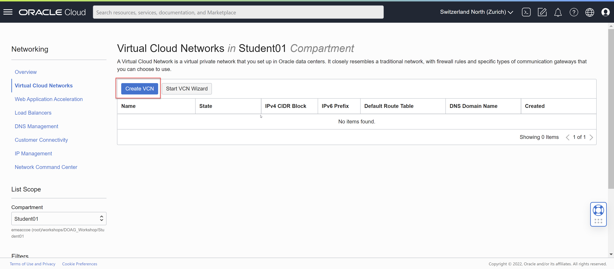

| Item                         | Value               | Bemerkungen  |
|:-----------------------------|:--------------------|:-------------|
| Name                         | vcn-doag-student-01 | keine        |
| Compartment                  | <Compartment>       | keine        |
| IPv4 CIDR Blocks             | 10.0.0.0/16         | keine        |

Table: VCN Konfigurationsvorgaben

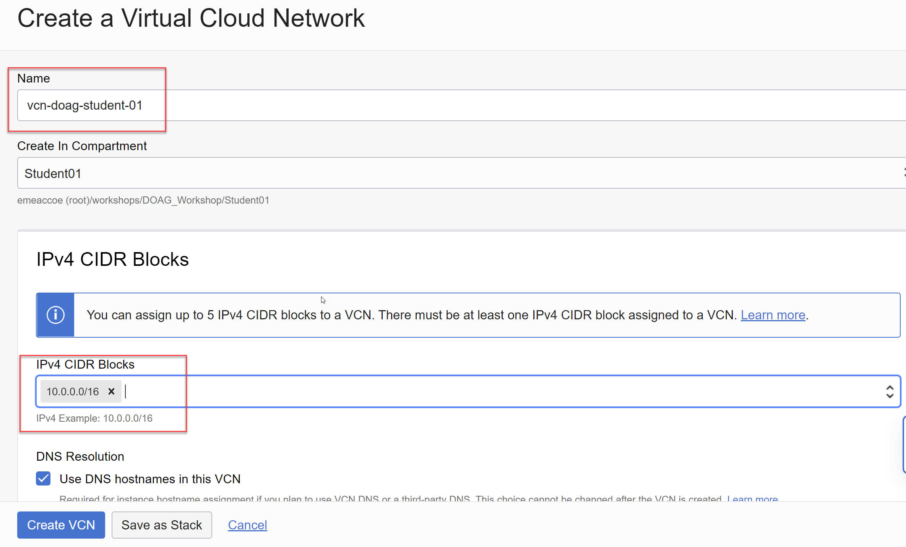

Die restlichen Einstellungen belassen, mit Klick auf _Create VCN_ wird die Resource erstellt und anschliessend angezeigt.

### Internet Gateway

Im erstellten VCN die Resource _Internet Gateways_ auswählen, _Create Internet Gateway_.

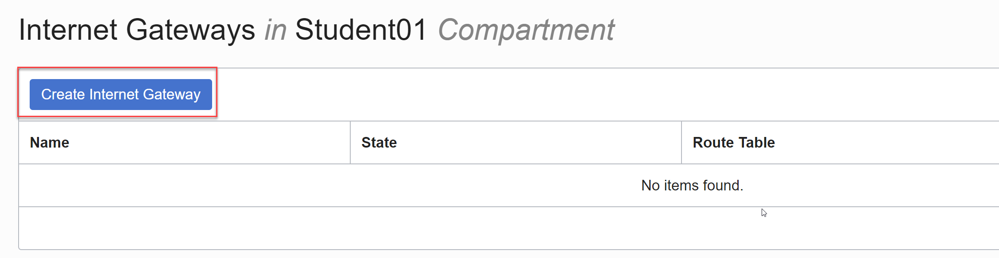

| Item                         | Value               | Bemerkungen  |
|:-----------------------------|:--------------------|:-------------|
| Name                         | igw-doag-student-01 | keine        |

Table: Internet Gateways Konfigurationsvorgaben

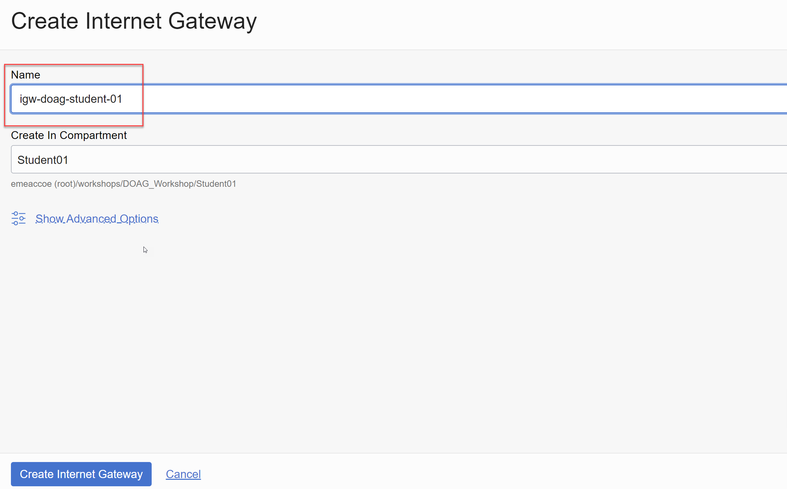

Die restlichen Einstellungen belassen, mit Klick auf _Create Internet Gateway_ wird die Resource erstellt und anschliessend angezeigt.

### NAT Gateway

Im erstellten VCN die Resource _NAT Gateways_ auswählen, _Create NAT Gateway_.

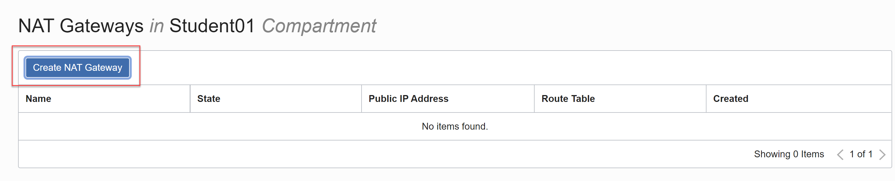

| Item                         | Value               | Bemerkungen  |
|:-----------------------------|:--------------------|:-------------|
| Name                         | ngw-doag-student-01 | keine        |

Table: NAT Gateways Konfigurationsvorgaben

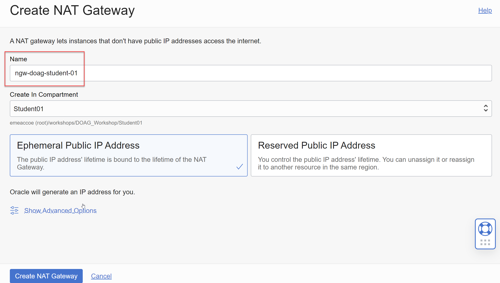

Die restlichen Einstellungen belassen, mit Klick auf _Create NAT Gateway_ wird die Resource erstellt und anschliessend angezeigt.

### Routing Table für Public Subnet

Die Route beinhaltet das Internet Gateway. Im erstellten VCN die Resource _Route Tables_ auswählen, _Create Route Table_.

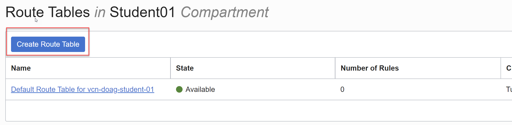

| Item                         | Value                      | Bemerkungen  |
|:-----------------------------|:---------------------------|:-------------|
| Name                         | rt-doag-student-01-public  | keine        |

Table: Public Routing Table Konfigurationsvorgaben

Fügen Sie folgende Route hinzu:

| Target Type                  | Value                      | Bemerkungen  |
|:-----------------------------|:---------------------------|:-------------|
| Internet Gateway             | rt-doag-student-01-public  | keine        |
| Destination CIDR Block       | 0.0.0.0/0                  | keine        |
| Target Internet Gateway      | igw-doag-student-01        | keine        |

Table: Public Routing Table Konfigurationsvorgaben

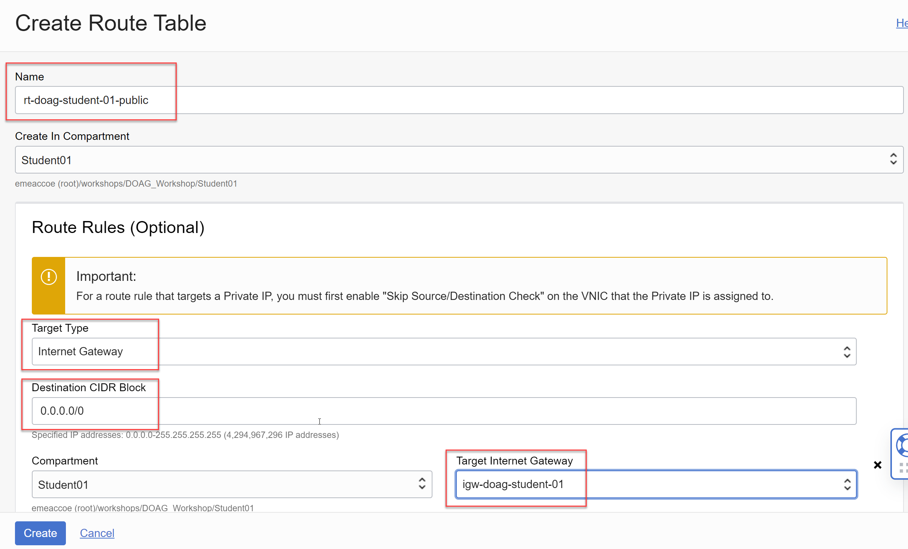

Die restlichen Einstellungen belassen, mit Klick auf _Create_ wird die Resource erstellt und anschliessend angezeigt.

### Routing Table für Private Subnet

Die Route beinhaltet das NAT Gateway. Im erstellten VCN die Resource _Route Tables_ auswählen, _Create Route Table_.

| Item                         | Value                      | Bemerkungen  |
|:-----------------------------|:---------------------------|:-------------|
| Name                         | rt-doag-student-01-private | keine        |

Table: Private Routing Table Konfigurationsvorgaben

Fügen Sie folgende Route hinzu:

| Target Type                  | Value                   | Bemerkungen  |
|:-----------------------------|:------------------------|:-------------|
| Internet Gateway             | rt-doag-student-public  | keine        |
| Destination CIDR Block       | 0.0.0.0/0               | keine        |
| Target NAT Gateway           | ngw-doag-student-01     | keine        |

Table: Private Routing Table Konfigurationsvorgaben

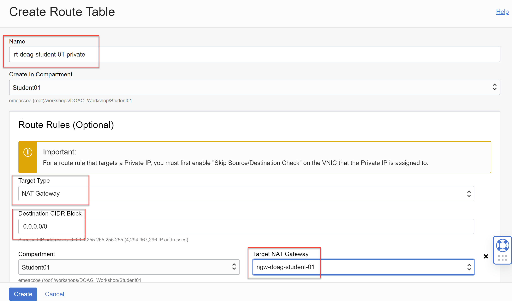

Die restlichen Einstellungen belassen, mit Klick auf _Create_ wird die Resource erstellt und anschliessend angezeigt.

### Security List für Public Subnet

Die Security List lässt Zugriff auf das Public Subnet von den Ports 22 (SSH) und 80 (http) zu.
Im erstellten VCN die Resource _Security Lists_ auswählen, _Create Security List_.

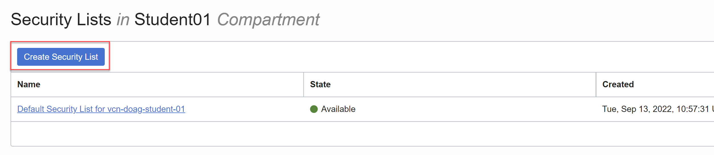

| Item                         | Value                      | Bemerkungen  |
|:-----------------------------|:---------------------------|:-------------|
| Name                         | sl-doag-student-01-public  | keine        |

Table: Public Subnet Konfigurationsvorgaben

Fügen Sie folgende Ingress-Regeln hinzu:

| Destination                  | Source Type & CIDR   | Port    | Protocol    |
|:-----------------------------|:---------------------|:--------|:------------|
| Ingress                      | CIDR 0.0.0.0/0       | 22      | TCP         |
| Ingress                      | CIDR 0.0.0.0/0       | 80      | TCP         |

Table: Ingress-Regeln Public Subnet

Fügen Sie folgende Egress-Regeln hinzu:

| Destination                  | Source Type & CIDR   | Port    | Protocol    |
|:-----------------------------|:---------------------|:--------|:------------|
| Egress                       | CIDR 0.0.0.0/0       | All     | All         |

Table: Egress-Regeln Public Subnet

Die restlichen Einstellungen belassen, mit Klick auf _Create Security List_ wird die Resource erstellt und anschliessend angezeigt.

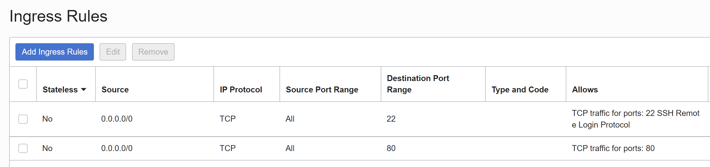
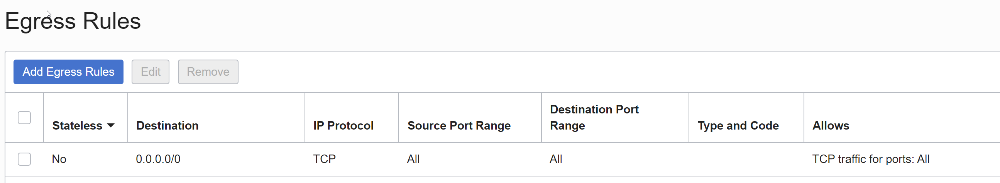

### Security List für Private Subnet

Die Security List lässt Zugriff auf das Private Subnet von den Ports 22 (SSH) und 1521 (sqlnet) aus dem Public Subnet zu.
Im erstellten VCN die Resource _Security Lists_ auswählen, _Create Security List_.

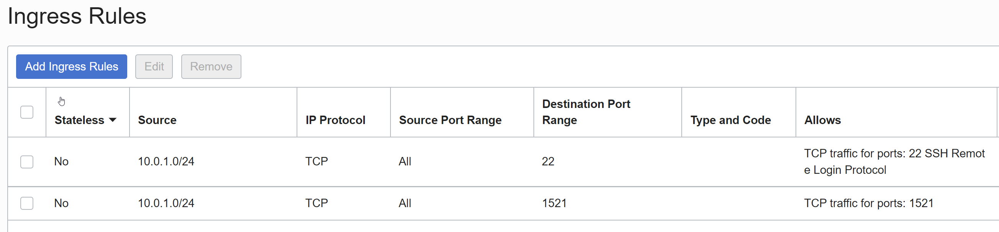

| Item                         | Value                      | Bemerkungen  |
|:-----------------------------|:---------------------------|:-------------|
| Name                         | sl-doag-student-01-private | keine        |

Table: Private Subnet Konfigurationsvorgaben

Fügen Sie folgende Ingress-Regeln hinzu:

| Destination                  | Source Type & CIDR   | Port    | Protocol    |
|:-----------------------------|:---------------------|:--------|:------------|
| Ingress                      | CIDR 10.0.1.0/24     | 22      | TCP         |
| Ingress                      | CIDR 10.0.1.0/24     | 1521    | TCP         |

Table: Ingress-Regeln

Fügen Sie folgende Egress-Regeln hinzu:

| Destination                  | Source Type & CIDR   | Port    | Protocol    |
|:-----------------------------|:---------------------|:--------|:------------|
| Egress                       | CIDR 0.0.0.0/0       | All     | All         |

Table: Egress-Regeln

Die restlichen Einstellungen belassen, mit Klick auf _Create Security List_ wird die Resource erstellt und anschliessend angezeigt.

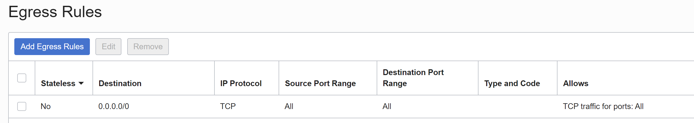

### Public Subnet

Im erstellten VCN die Resource _Subnets_ auswählen, _Create Subnet_.

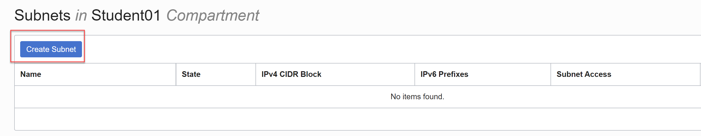

| Item                         | Value                     | Bemerkungen  |
|:-----------------------------|:--------------------------|:-------------|
| Name                         | sn-doag-student-01-public | keine        |
| Subnet Type                  | Regional                  | keine        |
| IPv4 CIDR Block              | 10.0.1.0/24               | keine        |
| Subnet Access                | Public                    | keine        |
| DNS Label                    | snstudentpub01            | keine        |
| Route Table                  | rt-doag-student-public    | keine        |
| DHCP Options                 | Default DHCP Options      | keine        |
| Security Lists               | sl-doag-student-01-public | keine        |

Table: Public Subnet Konfiguration

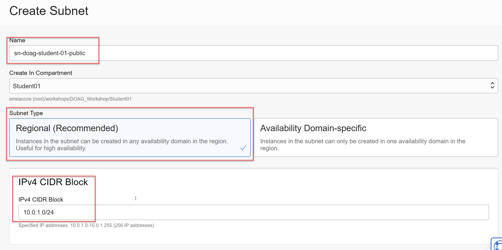
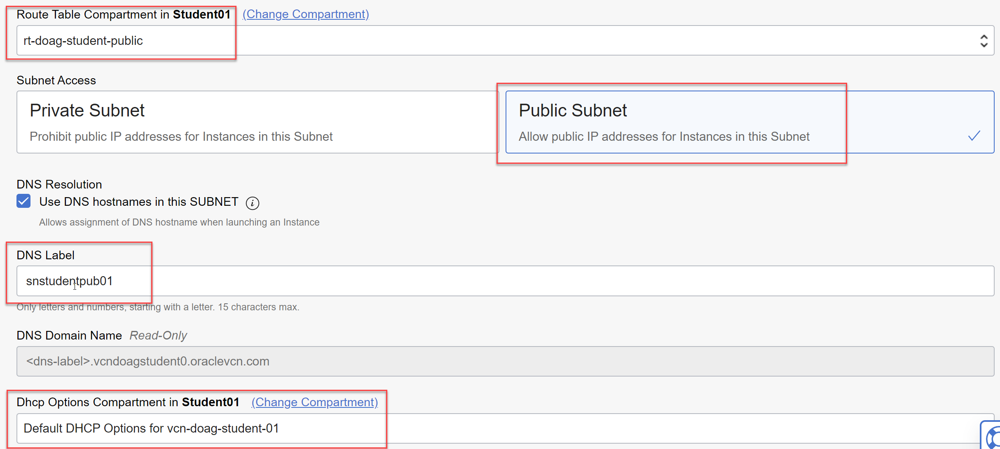

Die restlichen Einstellungen belassen, mit Klick auf _Create Subnet_ wird die Resource erstellt und anschliessend angezeigt.

### Private Subnets

Im erstellten VCN die Resource _Subnets_ auswählen, _Create Subnet_.

| Item                         | Value                          | Bemerkungen  |
|:-----------------------------|:-------------------------------|:-------------|
| Name                         | sn-doag-student-01-private-app | keine        |
| Subnet Type                  | Regional                       | keine        |
| IPv4 CIDR Block              | 10.0.2.0/24                    | keine        |
| Subnet Access                | Private                        | keine        |
| DNS Label                    | snstudentprv01                 | keine        |
| Route Table                  | rt-doag-student-private        | keine        |
| DHCP Options                 | Default DHCP Options           | keine        |
| Security Lists               | sl-doag-studet-01-private      | keine        |

Table: Private Subnet Konfiguration I

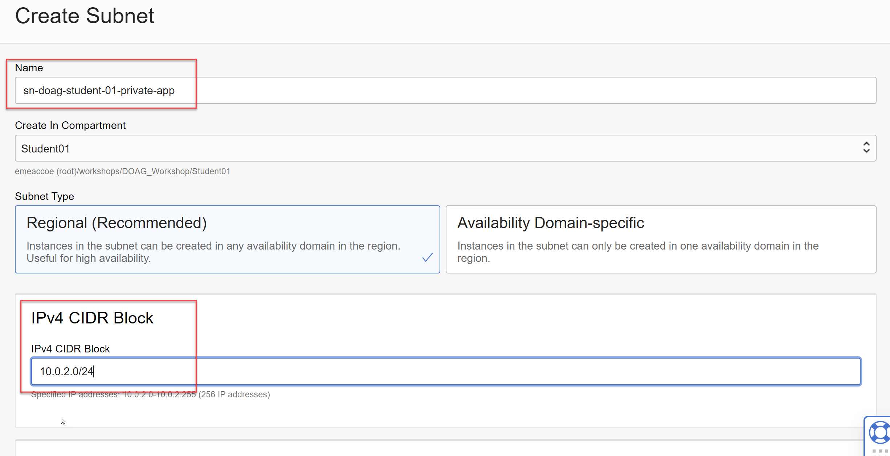
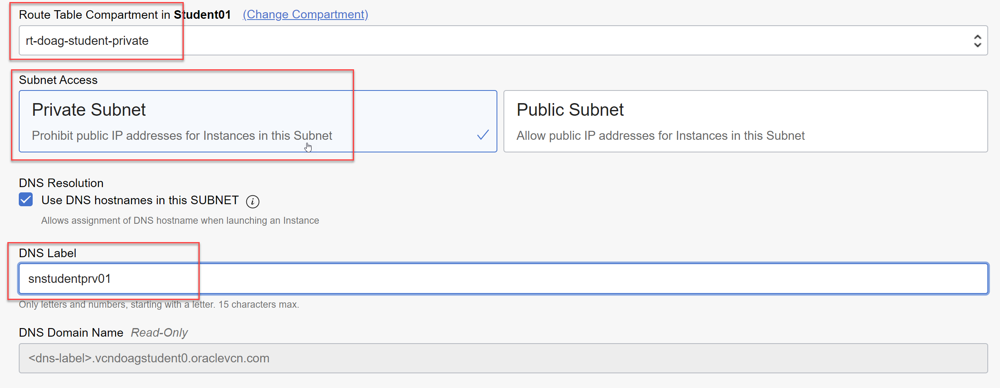
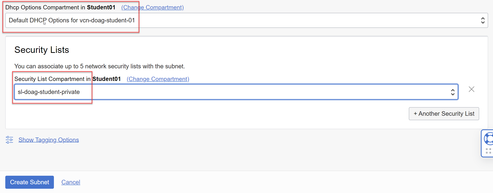

Die restlichen Einstellungen belassen, mit Klick auf _Create Subnet_ wird die Resource erstellt und anschliessend angezeigt.

Wiederholen Sie die Erstellen für das zweite private Subnet.

| Item                         | Value                          | Bemerkungen  |
|:-----------------------------|:-------------------------------|:-------------|
| Name                         | sn-doag-student-01-private-db  | keine        |
| Subnet Type                  | Regional                       | keine        |
| IPv4 CIDR Block              | 10.0.3.0/24                    | keine        |
| Subnet Access                | Private                        | keine        |
| DNS Label                    | snstudentprv02                 | keine        |
| Route Table                  | rt-doag-student-private        | keine        |
| DHCP Options                 | Default DHCP Options           | keine        |
| Security Lists               | sl-doag-student-01-private     | keine        |

Table: Private Subnet Konfiguration II

Übersicht der erstellten Subnets:

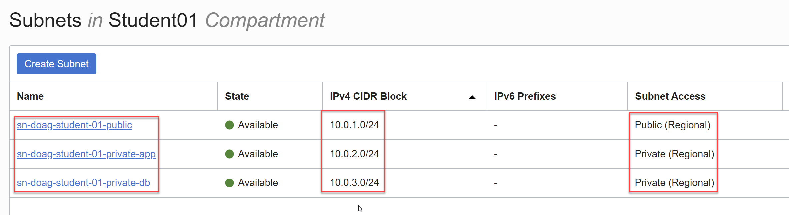
