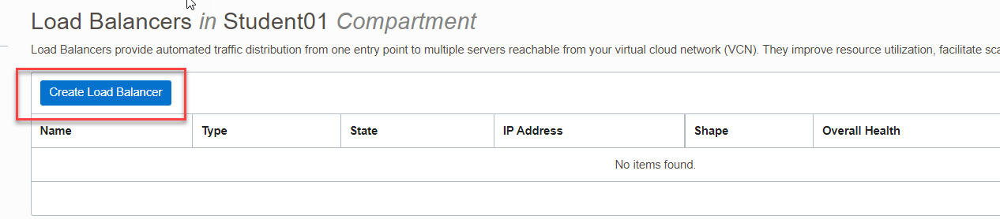
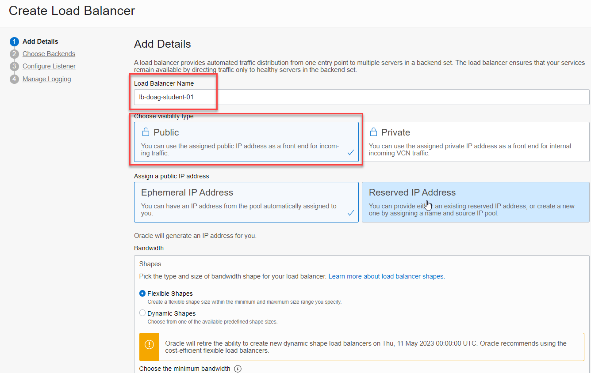
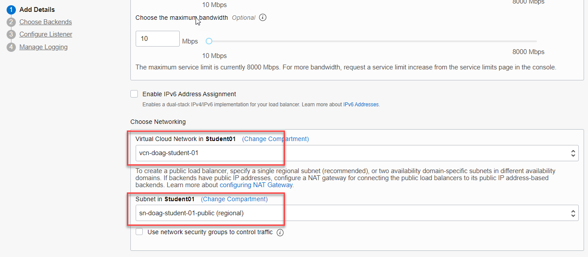
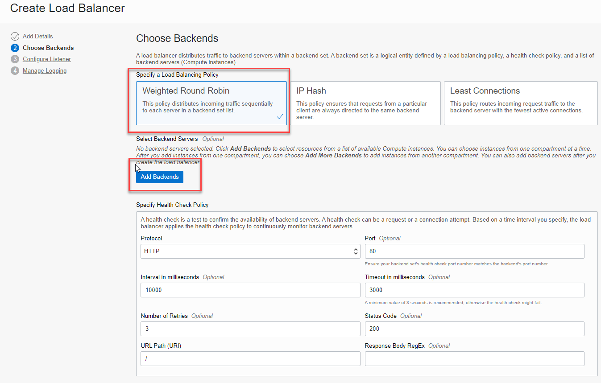
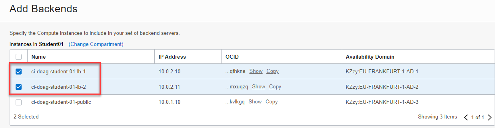
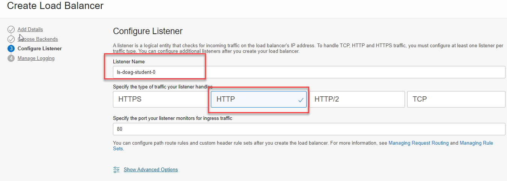
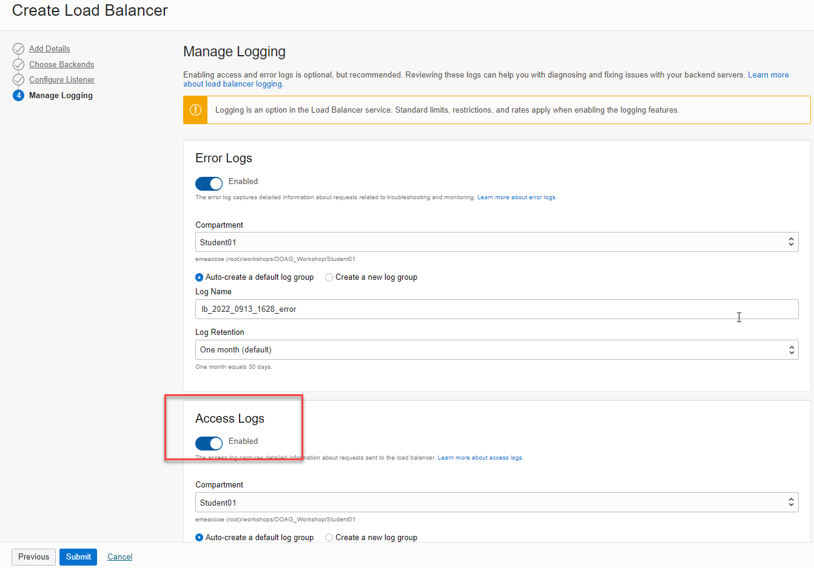
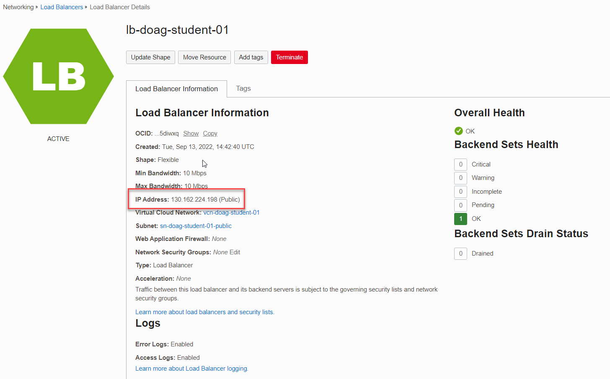

<!-- markdownlint-disable MD033 -->
<!-- markdownlint-disable MD013 -->
<!-- markdownlint-disable MD041 -->
## Compute Load Balancer

## Zwei Compute Instances im Private Subnet erstellen

Erstellen Sie zwei Compute Instances im Private Subnet der Applikationen. Installieren und Konfigurieren
Sie Apache für das spätere Loadbalancer Setup in der Cloud Shell via Private IP.

### Webserver LB1

| Item                         | Value                                      | Bemerkungen  |
|:-----------------------------|:-------------------------------------------|:-------------|
| Name                         | ci-doag-student-01-lb-1                    | keine        |
| Placement                    | AD1                                        | keine        |
| Shape                        | Reduzieren auf 4GB                         | keine        |
| Virtual Cloud Network        | vcn-doag-student-01                        | keine        |
| Subnet                       | sn-doag-student-01-private-app (Regional)  | keine        |
| Private IP Address           | 10.0.2.10                                  | keine        |
| Hostname                     | ci-doag-student-01-lb-1                    | keine        |
| Public IP address            | Do not assign a public IPv4 address        | keine        |
| SSH keys                     | Public SSH Key aus der Cloud Shell         | keine        |

Index html-File

```bash
sudo bash -c 'echo Das ist mein DOAG-Webserver 1 in der Oracle Cloud Infrastructure >> /var/www/html/index.html'
```

### Webserver LB2

| Item                         | Value                                      | Bemerkungen  |
|:-----------------------------|:-------------------------------------------|:-------------|
| Name                         | ci-doag-student-01-lb-2                    | keine        |
| Placement                    | AD2                                        | keine        |
| Shape                        | Reduzieren auf 4GB                         | keine        |
| Virtual Cloud Network        | vcn-doag-student-01                        | keine        |
| Subnet                       | sn-doag-student-01-private-app (Regional)  | keine        |
| Private IP Address           | 10.0.2.11                                  | keine        |
| Hostname                     | ci-doag-student-01-lb-2                    | keine        |
| Public IP address            | Do not assign a public IPv4 address        | keine        |
| SSH keys                     | Public SSH Key aus der Cloud Shell         | keine        |

Index html-File

```bash
sudo bash -c 'echo Das ist mein DOAG-Webserver 2 in der Oracle Cloud Infrastructure >> /var/www/html/index.html'
```


Schliessen Sie die Cloud Console.

### Load Balancer Konfiguration

_Networking_ -> _Load Balancer_ - einen neuen Load Balancer erstellen.




| Item                         | Value                                      | Bemerkungen  |
|:-----------------------------|:-------------------------------------------|:-------------|
| Load Balancer Name           | lb-doag-student-01                         | keine        |
| Visibility Type              | Public                                     | keine        |
| Virtual Cloud Network        | vcn-doag-student-01                        | keine        |
| Subnet                       | sn-doag-student-01-public                  | keine        |
| Load Balancing Policy        | Weighted Round Robin                       | keine        |
| Listener Name                | ls-doag-student-01                         | keine        |
| Type of Traffic              | http                                       | keine        |
| Public IP address            | Do not assign a public IPv4 address        | keine        |
| SSH keys                     | Public SSH Key aus der Cloud Shell         | keine        |

### Load Balancer Konfiguration - Add Details





_Next_.

### Load Balancer Konfiguration - Choose Backends

_Add Backends_ um die Webserver hinzuzufügen. Port bleibt auf 80. Die Webserver auswählen und _Add Selected Backends_ anklicken.





_Next_.

### Load Balancer Konfiguration - Configure Listener



_Next_.

### Load Balancer Konfiguration - Manage Logging

Access Logs aktivieren. Die restlichen Einstellungen behalten. Mit Klick auf _Submit_ wird die Resource erstellt.



_Submit_. Die Erstellung dauert ca. 5-10 Minuten. Der Health Check wird nach ein
paar Minuten auf grün gesetzt werden sofern die Webserver korrekt konfigurtiert sind.

Tip: Meistens scheitert es an fehlenden oder falschen Firewall-Einstellungen auf der Maschine oder in der OCI Security List.



### Test Erreichbarkeit Webserver via Loadbalancer

Verwenden Sie dazu die Load Balancer Public IP und ihren Browser der Workstation. URL: http://<ihre Public IP>.

Tip: Meistens scheitert es an fehlenden oder falschen Firewall-Einstellungen auf der Maschine oder in der OCI Security List.


Nach dem Browser-Refresh:


