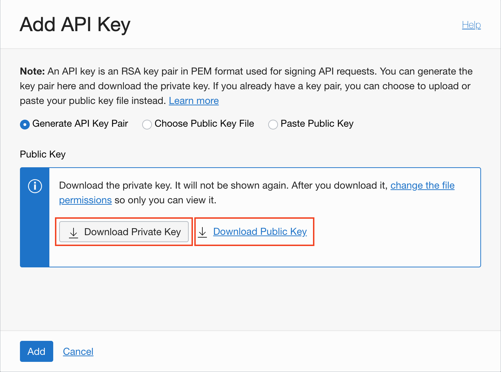

<!-- markdownlint-disable MD013 -->
<!-- markdownlint-disable MD025 -->
<!-- markdownlint-disable MD033 -->
<!-- markdownlint-disable MD041 -->
## Terraform Konfiguration

### Übungsziele {.unlisted .unnumbered}

Konfiguration des Terraform Providers für Oracle Cloud Infrastruktur (OCI)

### Aufgaben {.unlisted .unnumbered}

Für die Konfiguration werden wir folgende Schritte durchführen:

- Generieren eines API Key
- Zusammenstellen der Informationen für den Provider
- Test der Terraform Konfiguration und Initialisierung des Providers
- Umstellung auf Terraform Variablen

### API Key

Damit Terraform auf OCI zugreifen kann, muss ein entsprechender API Key vorhanden
sein respektive erstellt werden. Gehe dazu auf die Benutzer Einstellungen in der
OCI Konsole.


Bei den Ressourcen wähle die API Keys.


Erstelle einen neuen API Key.

::: caution
**Hinweise** Speichere unbedingt den generierten Private Key ab. Dieser wird für
den Zugriff benötigt und kann später nicht mehr heruntergeladen werden.
:::



Zum Abschluss werden die Konfiguration für das OCI-CLI angezeigt. Laden den
generierten Private sowie Public Key herunter und kopiere die
Informationen in ein Text File. Wir benötigen diese beim nächsten Schritt


::: note
**Hinweise** Falls Du vorher bereits die Übung zum [OCI CLI](../ex01/1x08-OCI-CLI.md)
gemacht hast, kannst Du alternativ auch den API Key vom OCI CLI verwenden
:::

### Informationen für den OCI Provider

Für die Konfiguration des OCI Provider müssen folgende Informationen vorhanden sein.
Die *API Key Konfigurationsübersicht* oben, hat diese bereits dargestellt. Falls nötig,
kann man diese, mit Ausnahme des Privaten Schlüssel, jeder jetzt wieder bei den
Benutzerinformationen in der OCI Konsole abrufen respektive mit *View Configuration*.

- **Tenant OCID** eindeutige ID des OCI Tenants
- **User OCID** eindeutige ID des OCI Tenants
- **Fingerprint** des API Keys
- **API Key** Pfad zum privaten API Key File z.B. *$HOME/.oci/tf_api_key.pem*
- **OCI Region** aktuell nutzen wir *eu-frankfurt-1* weitere Region und Region
  Keys findet man via [Regions and Availability Domains](https://docs.oracle.com/en-us/iaas/Content/General/Concepts/regions.htm#ServiceAvailabilityAcrossRegions)

Speichere den privaten sowie der öffentliche Schlüssel des API Key ab, so dass wir
diese später nutzen können.

```bash
mkdir -p $HOME/.oci
vi $HOME/.oci/tf_api_key.pem
vi $HOME/.oci/tf_api_key_public.pem
```

### Konfiguration OCI Provider

Der Terraform OCI Provider wird in der Datei *provider.tf* konfiguriert. Ergänze
die Informationen ab Zeile 30 entsprechend:

```bash
cd lab/ex09
vi provider.tf

provider "oci" {
  tenancy_ocid     = "<TENANCY_OCID>"
  user_ocid        = "<USER_OCID>"
  fingerprint      = "<FINGERPRINT>"
  private_key_path = "<PRIVATE_KEY_PATH>"
  region           = "<REGION>"
}
```

Initialisiere den Terraform Provider mit *terraform init*.

```bash
terraform init
```

Terraform erstellt im lokalen Verzeichnis ein neues Verzeichnis *.terraform*. Da
ist die aktuelle Version des OCI Providers sowie weiteres abgelegt (z.B. Module).

### ### Konfiguration OCI Provider mit Terraform Variablen

Das direkte abspeichern der Provider Konfiguration in den Terraform Dateien ist
nicht ganz ideal. Aus diesem Grund werden für die Informationen entsprechende
Terraform Variablen definiert. Siehe die Datei *variables.tf*.

```bash
cat variables.tf
```

Passe anschliessend die Provider Konfiguration ab der Zeile 30 wie folgt an:

```bash
#define the terraform provider
provider "oci" {
  tenancy_ocid     = var.tenancy_ocid
  user_ocid        = var.user_ocid
  fingerprint      = var.fingerprint
  private_key_path = var.private_key_path
  region           = var.region
}
```

Initialisiere den Terraform Provider mit *terraform init*.

```bash
terraform init
```
