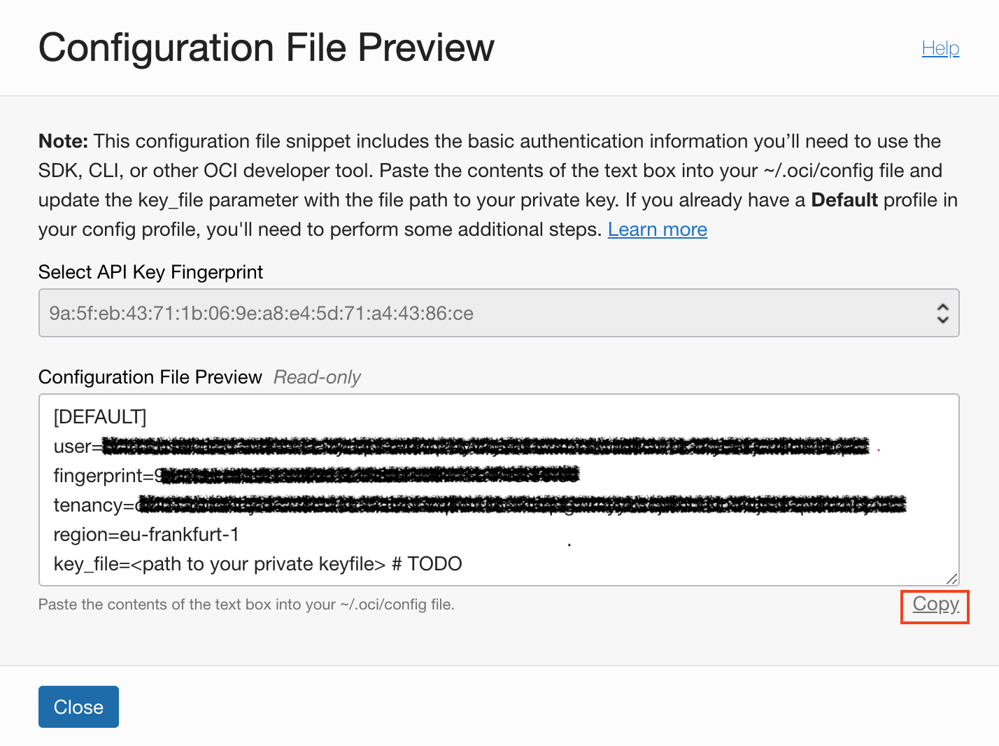

<!-- markdownlint-disable MD013 -->
<!-- markdownlint-disable MD025 -->
<!-- markdownlint-disable MD033 -->
<!-- markdownlint-disable MD041 -->
## Terraform Konfiguration

### Übungsziele {.unlisted .unnumbered}

Konfiguration des *Terraform* Providers für *Oracle Cloud Infrastruktur (OCI)*

### Aufgaben {.unlisted .unnumbered}

Für die Konfiguration werden wir folgende Schritte durchführen:

- Login via Cloud Shell und Clonen des [oehrlis/doag2022](https://github.com/oehrlis/doag2022) GitHub Repository
- Generieren eines API Key
- Zusammenstellen der Informationen für den Provider
- Test der *Terraform* Konfiguration und Initialisierung des Providers
- Umstellung auf *Terraform* Variablen

### Bereitstellen der Übungsunterlagen

Login in die Oracle Cloud Infrastructure Cloud Console und starten der Cloud Shell.
Für eine bessere Lesbarkeit kann die Terminal Grösse angepasst werden.


Clone das GitHub Repository in das aktuelle Verzeichnis.

```bash
git clone https://github.com/oehrlis/doag2022.git
```


::: note
**Hinweise** Das GitHub Repository [oehrlis/doag2022](https://github.com/oehrlis/doag2022)
wird an dieser Stelle geklont. Wir verwenden das gleich Repository und die Verzeichnisse
auch für die weiteren Übungen.
:::

### API Key

Damit *Terraform* auf OCI zugreifen kann, muss ein entsprechender API Key vorhanden
sein respektive erstellt werden. Gehe dazu auf die Benutzer Einstellungen in der
OCI Konsole.

*User Settings*_* -> *API Key* -> *Add API Key*.

{:width="400px"}

Bei den Ressourcen wähle die API Keys.

{:width="500px"}

Erstelle einen neuen API Key.

::: caution
**Hinweise** Speichere unbedingt den generierten Private Key ab. Dieser wird für
den Zugriff benötigt und kann später nicht mehr heruntergeladen werden.
:::

{:width="500px"}

Zum Abschluss werden die Konfiguration für das OCI-CLI angezeigt. Laden den
generierten Private sowie Public Key herunter und kopiere die
Informationen in ein Text File. Wir benötigen diese beim nächsten Schritt



::: note
**Hinweise** Falls Du vorher bereits die Übung zum [OCI CLI](../ex01/1x08-OCI-CLI.md)
gemacht hast, kannst Du alternativ auch den API Key vom OCI CLI verwenden
:::

### Informationen für den OCI Provider

Für die Konfiguration des OCI Provider müssen folgende Informationen vorhanden sein.
Die *API Key Konfigurationsübersicht* oben, hat diese bereits dargestellt. Falls nötig,
kann man diese, mit Ausnahme des Privaten Schlüssel, jeder jetzt wieder bei den
Benutzerinformationen in der OCI Konsole abrufen respektive mit *View Configuration*.

- **Tenant OCID** eindeutige ID des OCI Tenants
- **User OCID** eindeutige ID des OCI Tenants
- **Fingerprint** des API Keys
- **API Key** Pfad zum privaten API Key File z.B. *$HOME/.oci/tf_api_key.pem*
- **OCI Region** aktuell nutzen wir *eu-frankfurt-1* weitere Region und Region
  Keys findet man via [Regions and Availability Domains](https://docs.oracle.com/en-us/iaas/Content/General/Concepts/regions.htm#ServiceAvailabilityAcrossRegions)

Speichere den privaten sowie der öffentliche Schlüssel des API Key ab, so dass wir
diese später nutzen können.

```bash
mkdir -p $HOME/.oci
vi $HOME/.oci/tf_api_key.pem
vi $HOME/.oci/tf_api_key_public.pem
```

### Konfiguration OCI Provider

Der *Terraform* OCI Provider wird in der Datei *provider.tf* konfiguriert. Ergänze
die Informationen ab Zeile 30 entsprechend:

```bash
cd $HOME/doag2022/lab/ex09
vi provider.tf

provider "oci" {
  tenancy_ocid     = "<TENANCY_OCID>"
  user_ocid        = "<USER_OCID>"
  fingerprint      = "<FINGERPRINT>"
  private_key_path = "<PRIVATE_KEY_PATH>"
  region           = "<REGION>"
}
```

Initialisiere den *Terraform* Provider mit *terraform init*.

```bash
terraform init
```

Terraform erstellt im lokalen Verzeichnis ein neues Verzeichnis *.terraform*. Da
ist die aktuelle Version des OCI Providers sowie weiteres abgelegt (z.B. Module).

### Konfiguration OCI Provider mit Terraform Variablen

Das direkte abspeichern der Provider Konfiguration in den *Terraform* Dateien ist
nicht ganz ideal. Aus diesem Grund werden für die Informationen entsprechende
*Terraform* Variablen definiert. Siehe die Datei *variables.tf*.

```bash
cat variables.tf
```

Passe anschliessend die Provider Konfiguration ab der Zeile 30 wie folgt an:

```bash
#define the terraform provider
provider "oci" {
  tenancy_ocid     = var.tenancy_ocid
  user_ocid        = var.user_ocid
  fingerprint      = var.fingerprint
  private_key_path = var.private_key_path
  region           = var.region
}
```

Initialisiere den Terraform Provider mit *terraform init*.

```bash
terraform init
```

Wie Du in der Datei *variables.tf* sehen kannst, sind für alle Variablen keine
Standartwerte gesetzt. Dementsprechend wird *Terraform* im Folgenden jeweils die hier
definierten Variablen interaktiv abfragen. Um dies zu Vermeiden, kann man für alle
*Terraform* Variablen auch entsprechende [Umgebungsvariablen](https://www.terraform.io/cli/config/environment-variables)
mit dem Prefix *TF_VAR_* definieren. Alternativ kann man auch eine
*terraform.tfvars* mit den entsprechenden Variablen Werten definieren.

::: note
**Hinweise** Wenn der *Terraform* Code in einem Version Control wie GIT verwaltet
wird, sollte man die Konfiguration der OCI Credentials nicht im GIT ein checken.
Es bietet sich daher an Umgebungsvariablen sowie *terraform.tfvars* zu kombinieren.
z.B. User Credentials jeweils lokal via Umgebung setzten.
:::

Hinzufügen der *region* und optional auch der *tenancy_ocid* in der Datei
*terraform.tfvars*.

- **tenancy_ocid** gemäss OCI Konsole
- **region** *eu-frankfurt-1*

```bash
vi terraform.tfvars

# defined by environment variables ---------------------------------------------
# fingerprint                 = ""
# private_key_path            = ""
# tenancy_ocid                = ""
# user_ocid                   = ""

# provider identity parameters -------------------------------------------------
region = "eu-frankfurt-1"
```

für die User spezifischen Variablen erstellen wir eine *env* Datei, welche wir jeweils
laden können. Alternativ kann man das auch direkt in seinem Bash Profile ablegen.

```bash
vi $HOME/tf_env

export TF_VAR_lab_id="$(id -u -n| tail -c 3)"
export TF_VAR_lab_compartment_name="Student$(id -u -n| tail -c 3)"
export TF_VAR_tenancy_ocid="WERT-AUS-CONSOLE"
export TF_VAR_user_ocid="WERT-AUS-CONSOLE"
export TF_VAR_fingerprint="WERT-AUS-CONSOLE"
export TF_VAR_private_key_path="PFAD"
```

Laden der Umgebungsvariablen

```bash
. $HOME/tf_env
env|grep -i TF_VAR
```

*Terraform* initialisieren (nicht mehr zwingend nötig)

```bash
terraform init
```

*Terraform plan* erstellen. Erst bei diesem Schritt nutzt *Terraform* explizit die
definierten Credentials.

```bash
terraform plan -out=login.tfplan
```

*Terraform apply* ausführen. Wobei *apply* bei diesem Beispiel nicht nötig ist.
Die Terraform konfiguration enthält neben dem Provider lediglich noch eine
Abfrage in der Datei *datasource.tf* mit der Ausgabe in *outputs.tf*.

```bash
terraform apply login.tfplan
```

::: note
**Hinweise** Im vorliegenden Beispiel haben wir die verschiedenen *Terraform*
Konfigurationen in unterschiedliche Dateien geschrieben. Grundsätzlich ist es
auch möglich alles in eine Datei zu schreiben. Es ist aber *Best Practice* bei
*Terraform* dies in entsprechend verschiedene Dateien aufzuteilen. Dies ermöglicht
es auch Code bereits ohne Module einfacher wieder zu verwenden.
:::
